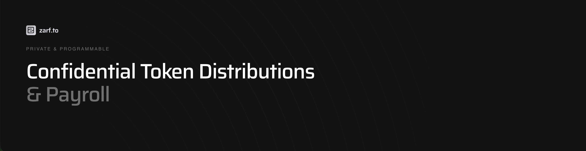

# Zarf Protocol

**Confidential Token Distributions & Payroll**

[zarf.to](https://zarf.to)

> **Showcase Project** — This is a demonstration project by [Trion Labs](https://trionlabs.dev) showcasing our expertise in Zero-Knowledge systems and protocol design. For production implementations or collaborations, [contact us](mailto:contact@trionlabs.dev).



## Overview

Distribute tokens to emails with ZK proofs. No wallet exposure. No identity leaks.

Zarf Protocol is a privacy-first payment and token distribution protocol that enables users to send funds or create vestings to an email address instead of a wallet address. By utilizing zero-knowledge proofs, we decouple identity from on-chain addresses, allowing for secure, anonymous, and programmable payments.

## Features

### 🔒 Privacy Powered with ZK
Distribute tokens without exposing recipient identities on-chain. Zarf uses advanced zero-knowledge circuits (Noir) to verify email ownership without ever revealing the email address or the link to the claiming wallet.

### ⚡ E-mail First Claiming
No wallet needed to start. Recipients receive funds via an email link and can claim them using a standard Google login. This dramatically lowers the barrier to entry for non-crypto natives.

### ⏳ On-chain & Programmable
Configure cliff periods, linear release schedules, and complex vesting terms directly in smart contracts. Zarf is not just for one-time payments; it's a robust infrastructure for payroll, grants, and token streaming.

## Architecture


1. **Off-chain ZK Proof Generation**: Users generate proofs of email ownership locally in the browser or via a secure relayer.
2. **Smart Contracts (Stellar/Soroban)**:
    - **JWK Registry**: Manages trusted Google JWK key hashes for email proof validation.
    - **Vesting and Factory**: Holds funds, creates vesting contracts, and releases funds after valid claims.
    - **UltraHonk Verifier**: Stores the Noir verification key and validates ZK proofs on Soroban.
3. **Frontend**: A seamless Svelte-based interface for sending and claiming.
4. **JWK Rotation Service**: A scheduled Cloudflare Worker keeps Google OAuth
   public keys synchronized with the Soroban JWK Registry.

## Tech Stack

- **Zero-Knowledge**: [Noir](https://noir-lang.org/) (Project Aztec)
- **Contracts**: Stellar/Soroban smart contracts in Rust
- **Frontend**: [Svelte](https://svelte.dev/) + [Vite](https://vitejs.dev/)
- **Interaction**: [Stellar SDK](https://stellar.github.io/js-stellar-sdk/) / Freighter

## Development

### Prerequisites

- [Noir](https://noir-lang.org/) v1.0.0-beta.17
- Rust + `wasm32v1-none`
- [Stellar CLI](https://developers.stellar.org/docs/tools/cli/install-cli)
- Node.js 18+
- pnpm

### Quick Start

1. **Install Dependencies**
    ```bash
    pnpm install
    ```

2. **Build Circuits**
    ```bash
    cd circuits
    nargo build
    ```
    *Generates the Noir circuit artifact used by the Stellar proof generator.*

3. **Test Soroban Contracts**
    ```bash
    cargo test --manifest-path contracts/soroban/verifier/Cargo.toml
    cargo test --manifest-path contracts/soroban/zarf/jwk-registry/Cargo.toml
    cargo test --manifest-path contracts/soroban/zarf/vesting/Cargo.toml
    cargo test --manifest-path contracts/soroban/zarf/factory/Cargo.toml
    ```

4. **Run Development Server**
    ```bash
    cd web
    pnpm dev
    ```

5. **Run JWK Rotation Worker**
    ```bash
    cd web
    pnpm --filter @zarf/jwk-rotation typecheck
    pnpm dev:jwk-rotation
    ```

## Team

Built by **Trion Labs**. We are a team of engineers and researchers specialized in Applied Cryptography, Zero-Knowledge Systems, and Protocol Design.

## Contact

- **Website**: [trionlabs.dev](https://trionlabs.dev)
- **Email**: contact@trionlabs.dev
- **X (Twitter)**: [@trionlabs](https://x.com/trionlabs)

## License

[MIT License](./LICENSE)
