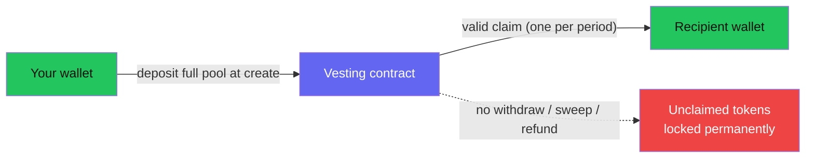

There are three costs to a Zarf distribution: the tokens you **deposit**, the
**network fees** to create it, and the small fee each recipient pays to
**claim**. This page breaks them down and covers the most important funding
rule: **deposited tokens can only leave through a valid claim.**

## What you deposit

At creation you deposit the **entire pool amount** into the vesting contract. In
the email flow this happens in a single `create_campaign` call using email/ZK +
epoch modes — the factory deploys your contract and transfers the full total
into it atomically, after you approve the token allowance. The create wizard requires your recipient
allocations to sum to exactly the pool, so you deposit precisely what you
intend to hand out.

## Network fees

- **Creating a distribution** costs the fees for **two transactions**: the token
  allowance approval and the combined create-and-fund call. On testnet these are
  ordinary Soroban fees (a small fraction of an XLM). Pinning the claim list to
  IPFS costs you nothing beyond signing a message.
- **Claiming** costs roughly **0.0225 XLM per claim** — measured on testnet as
  225,499 stroops of fee charged for a real ZK claim (inclusion + resource fees,
  with a partial refund). A verified UltraHonk proof fits inside Soroban's
  100M-instruction budget using native BN254 host functions, so the claim goes
  through in a single transaction.

### Who pays the claim fee

The claim transaction is **authorized by the recipient** (the contract requires
the recipient's signature on `claim`), so by default the **recipient pays** the
~0.0225 XLM for their own claim. If your audience is new to Stellar, plan for
the fact that each recipient needs a little XLM in their wallet to claim, and
they'll pay it once per period they claim.

<!-- TODO(verify): whether Zarf offers any fee-bump / sponsored-reserve path so recipients can claim without holding XLM — not found in the create/contract sources reviewed -->

### Recipients need to be able to receive the token

For a standard Stellar asset, a recipient's wallet must be able to hold the
token (a trustline) for the transfer to succeed. If a recipient reports that a
claim "succeeded" but nothing arrived, this is the usual cause — point them to
[Troubleshooting](/recipients/troubleshooting/).

## Storage rent and TTL

Soroban contract state has a **time-to-live (TTL)** and must be kept alive. Zarf
targets roughly a **120-day** TTL and re-extends it on every state-changing call
(create, deposit, claim). But a contract that sits idle — for example between
widely spaced vesting periods — can have its state **archived** once the window
lapses, and archived state must be **restored** (an on-chain operation) before
the next claim can go through.

If your schedule has long gaps, someone needs to keep the contract's state
extended. See the TTL duty in
[Operational notes](/creators/operational-notes/) for who does this and how, and
note the WASM-lag caveat in [Deployed contracts](/resources/deployed-contracts/):
contract fixes around TTL extension were merged in source but the deployed
testnet contracts may still run older WASM.

## Unclaimed funds cannot be withdrawn

:::danger[No owner sweep — plan your funding carefully]
The vesting contract has **no** `withdraw`, `sweep`, `refund`, or `recover`
function. Deposited tokens can leave the contract **only** through a valid
claim. That means:

- Tokens for recipients who **never claim** stay in the contract **permanently**.
- Any amount you **over-fund** is **locked forever** — there is no way to get it
  back.
- Only distribute what you can afford to lock. This is
  [known issue 003](/developers/security-model/); it makes the contract
  rug-resistant, but it also means there is no post-distribution reclamation.
:::

There is also **no on-chain check that the deposit covers all claims**. Because
the create wizard forces allocations to equal the pool, a normally created
distribution is fully funded. But if a contract were ever under-funded, claims
would be first-come-first-served until the balance ran out, and later valid
claimants would fail with a token-transfer error.

## Cost checklist

- [ ] Pool amount you can afford to **lock** (unclaimed tokens don't come back).
- [ ] Test XLM in your wallet for the two create transactions.
- [ ] Recipients have (or can get) a little XLM to pay ~0.0225 XLM per claim.
- [ ] Recipients can hold the token you're distributing.
- [ ] A plan to keep the contract's TTL extended if the schedule spans months.

Related: [Vesting design](/creators/vesting-design/) ·
[Operational notes](/creators/operational-notes/) ·
[Monitoring](/creators/monitoring/).
