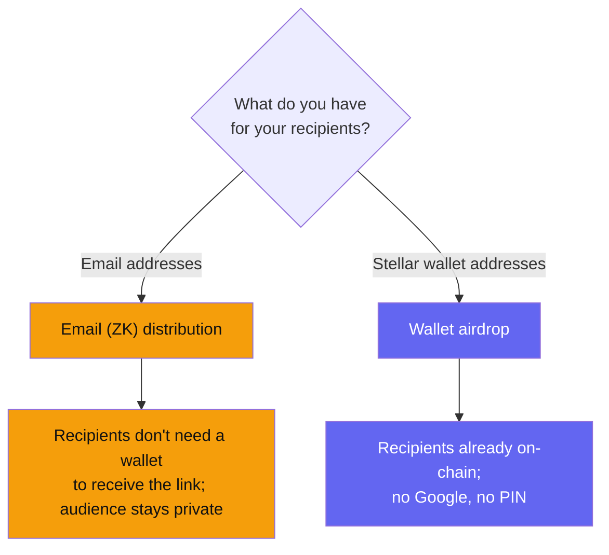

Zarf offers two ways to distribute tokens. They share the same vesting engine
but differ in how recipients prove they're eligible.

- **Email (ZK) distribution** — you upload emails; recipients sign in with
  Google and enter a PIN, and their browser proves they own the email without
  revealing it on-chain. Created in the UI at
  [create.zarf.to](https://create.zarf.to).
- **Wallet airdrop** — you upload Stellar addresses; recipients connect a wallet
  and claim if their address is in the whitelist. Recipients claim at
  [airdrop.zarf.to](https://airdrop.zarf.to).

## The one-question decision

If you have **emails, not addresses** — for example a mailing list, a community
sign-up, or a payroll roster — use the **email flow**. If you already have an
**on-chain community** whose wallet addresses you know, use the **wallet
airdrop**.

## Side by side

| | Email (ZK) distribution | Wallet airdrop |
|---|---|---|
| **Recipient identifier** | Email address | Stellar wallet address |
| **Recipient proves eligibility with** | Google sign-in + PIN → zero-knowledge proof in the browser | Connecting the whitelisted wallet |
| **Recipient needs a wallet up front** | No — they can create one during the claim | Yes |
| **What goes on-chain** | Merkle root + audience hash (no emails) | Merkle root of the address list |
| **Privacy** | Email never touches the chain; wallet ↔ email link never revealed | Recipient addresses are the audience |
| **Claim origin** | `claim.zarf.to` (isolated on its own origin for the ZK prover) | `airdrop.zarf.to` (strict CSP, no ZK) |
| **Proof cost to recipient** | ~0.0225 XLM per claim (testnet, measured) | A standard Soroban transaction fee |
| **Vesting engine** | Shared — cliff + fixed-length periods | Shared — cliff + fixed-length periods |

For how the email flow keeps addresses off-chain, see
[Privacy model](/learn/privacy-model/).

## What's available today

The **email (ZK) flow has a full create UI** at
[create.zarf.to](https://create.zarf.to) — follow the
[Quickstart](/creators/quickstart/).

The **wallet-airdrop create path is currently script-driven**: distributions are
deployed with the repository's `deploy_demo_airdrop.ts` script (which builds a
keccak Merkle claim-list, pins it, and calls the configured factory's
wallet-mode `create_campaign`), while recipients claim through the
[airdrop.zarf.to](https://airdrop.zarf.to) UI. There is not yet a hosted
point-and-click create screen for wallet airdrops.

<!-- verified 2026-07-02: apps/airdrop-create ships only src/routes/dev/+page.ts, hard-gated with `if (!dev) throw error(404)` — no production create UI -->

## When to use which

- **Community airdrop to a mailing list** → email flow. See the
  [airdrop playbook](/creators/playbooks/airdrop/).
- **Airdrop to known on-chain wallets** → wallet airdrop.
- **Payroll or contributor payments by email** → email flow with a vesting
  schedule. See the [payroll playbook](/creators/playbooks/payroll/).
- **Grants and bounties** → either, depending on whether you're paying an email
  or a known address. See the [grants playbook](/creators/playbooks/grants/).

## Next steps

- [Quickstart](/creators/quickstart/) — deploy the email flow end to end.
- [CSV format](/creators/csv-format/) — prepare your recipient list.
- [Vesting design](/creators/vesting-design/) — design the schedule.
- [Costs and funding](/creators/costs-and-funding/) — predict the full cost.
