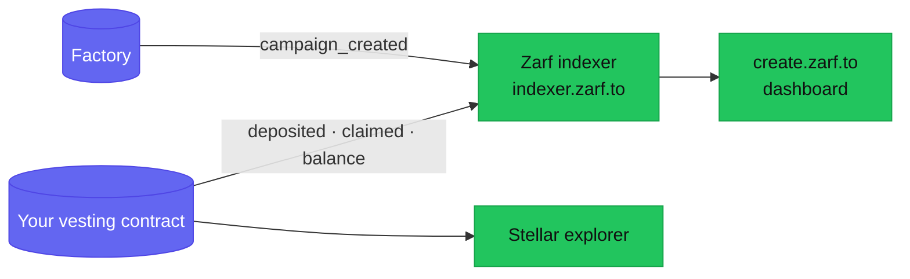

Once your distribution is deployed and funded, everything you need to track it
is already on-chain. This page shows you where to look: the create.zarf.to
dashboard, the events your contract emits, the Zarf indexer, and a block
explorer.

Zarf runs on **testnet only** today (mainnet launch is
[audit-gated](/creators/operational-notes/)), so every address, balance, and
explorer link below is testnet data.

## What you can see at a glance

The **My Distributions** dashboard at
[create.zarf.to](/creators/quickstart/) reads your live contracts straight from
the chain. It groups them into three tabs:

- **Drafts** — distributions you started but have not deployed yet. These are
  saved locally in your browser, not on-chain.
- **Active** — deployed contracts that still hold a token balance.
- **History** — deployed contracts whose balance has reached zero (fully
  claimed or emptied).

The Active/History split is decided by one thing: whether the contract still
holds funds. A distribution moves to History only when its token balance hits
zero.

Open any contract to see its detail panel:

- **Current balance** — how much of your token the contract still holds.
- **Contract address** — the on-chain address of this distribution.
- **Schedule** — start date, cliff duration, vesting duration, period, and
  total periods. This is read from the distribution's IPFS metadata, not from
  the contract's own storage.
- **Links** — *View on Stellar Explorer* and *View Metadata on IPFS*.

<!-- TODO(screenshot): create.zarf.to → My Distributions → an Active distribution's detail panel -->

## The three signals of progress

There is no single "42 of 100 claimed" counter. Instead you read progress from
three sources:

1. **Remaining balance** — the fastest signal. Deposited total minus current
   balance is the amount that has been claimed so far.
2. **`claimed` events** — one is emitted every time a recipient successfully
   claims. Counting them tells you how many claims have landed.
3. **Per-recipient claim status** — the indexer can tell you whether a specific
   epoch commitment has been claimed (see
   [Querying the indexer](#querying-the-indexer)).

## Events your contract emits

Both the factory and each vesting contract publish events you can read from an
explorer or your own indexer:

| Event | Emitted by | Topics | Data | Meaning |
|---|---|---|---|---|
| `campaign_created` | Factory | campaign, owner, token | claim_authorization, claim_schedule, reclaim_policy, claim_deadline, total_amount, recipient_count, merkle_root, metadata_cid | A campaign was deployed. When you deploy through create.zarf.to it is also funded in the same transaction, so `total_amount` is your funded total. |
| `deposited` | Vesting | — | amount | A standalone top-up deposit landed. The default create.zarf.to flow funds during creation, so you only see this if you deposit again later. |
| `claimed` | Vesting | epoch_commitment, recipient | amount | A recipient successfully claimed `amount` to their wallet. |
| `merkle_root_set` | Vesting | merkle_root | — | The recipient list root was set (only if it was not set at creation). |
| `owner_set` | Vesting | previous_owner, new_owner | — | Ownership of the contract was transferred. |

The `claimed` event's `epoch_commitment` is a commitment, not an email or a
name — see [What you can and cannot see](#what-you-can-and-cannot-see) below.

## Querying the indexer

The dashboard talks to the Zarf indexer at `indexer.zarf.to`, and you can query
it directly. Every path includes the network (`testnet`). A few useful reads:

- **All of your distributions:**
  `GET /v1/testnet/owners/{your-wallet-address}/vestings`
- **One distribution's summary** (name, token, balance, owner, merkle root,
  metadata CID): `GET /v1/testnet/vestings/{contract-address}`
- **Whether specific epochs were claimed** (batch, up to 100 commitments):
  `GET /v1/testnet/vestings/{contract-address}/claimed?commitments={hex32},{hex32},...`
- **A single epoch's claim status:**
  `GET /v1/testnet/vestings/{contract-address}/claimed/{commitment}`

For the complete endpoint list, response shapes, and limits, see the
[indexer API reference](/developers/indexer-api/).

### Caching you should know about

The indexer caches reads at the edge, sized to how quickly each answer can
change:

- A **claimed = true** result is permanent (a committed claim never reverts),
  so it is cached for a long time.
- A **claimed = false** result is cached only briefly, so it flips quickly once
  a claim lands.
- A **distribution's balance** is carried inside its summary, which has a short
  cache (about a minute), so the balance you see can trail the chain by up to
  that long.

If you want to force a fresh read on a cacheable endpoint, add `?refresh=1` to
the request.

## What you can and cannot see

This matters most for **email (ZK) distributions**, where privacy is the whole
point.

**You can see:**

- How much has been claimed (from the balance and from `claimed` events).
- The wallet addresses that received tokens (the `recipient` topic on each
  `claimed` event) and the amounts.
- Your recipient count and funded total (from `campaign_created`).

**You cannot see:**

- Which email maps to which wallet. Emails never touch the chain — only a
  Merkle root does — so there is no on-chain link between an identity and a
  wallet. See the [privacy model](/learn/privacy-model/).
- Which named person has not claimed yet. On-chain you only see
  `epoch_commitment` values, which are commitments, not identities.

You do hold the recipient list and per-recipient PINs you generated at creation
time, but you cannot correlate those to on-chain wallets. If you need to nudge
non-claimers, you nudge them by email, not by watching the chain.

For **wallet airdrops** the recipient addresses were chosen by you in the first
place, so watching claims per address is straightforward.

## Using a block explorer

Every distribution detail view links to *View on Stellar Explorer*. On testnet
that is stellar.expert's testnet explorer. There you can browse the contract's
transactions, its raw events (including every `claimed`), and its current token
holdings — useful as an independent check on anything the dashboard shows.

## If something looks wrong

- **A recipient says they claimed but the balance did not move** — confirm the
  transaction actually succeeded on the explorer; a failed claim reverts and
  transfers nothing. See [recipient troubleshooting](/recipients/troubleshooting/).
- **Claims are failing across the board** — this can be a stale Google signing
  key; read the JWK dependency section in
  [operational notes](/creators/operational-notes/).
- **A distribution never leaves Active even though everyone claimed** — it still
  holds unclaimed or over-funded tokens, which cannot currently be swept. See
  [operational notes](/creators/operational-notes/) and
  [costs and funding](/creators/costs-and-funding/).
