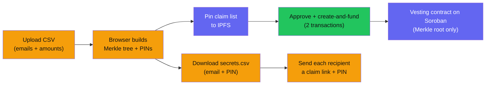

This guide walks you through your first **email (ZK) distribution** at
[create.zarf.to](https://create.zarf.to) — the flow where recipients claim with
a Google sign-in and a PIN, and only a Merkle root of your audience ever touches
the chain. If you instead have a list of wallet addresses, read
[Email vs wallet](/creators/email-vs-wallet/) first to pick the right flow.

:::caution[Testnet only]
Zarf runs on **Stellar testnet** today. Mainnet is deliberately gated on a
third-party security audit — it is not a delay, it is the plan. Do not treat
testnet distributions as production. See
[Project status](/resources/project-status/).
:::

## Goal

Create, fund, and hand out claim details for a small email distribution on
testnet.

## Before you start

- **Freighter** wallet installed and switched to **Testnet**.
- Some **test XLM** in that wallet to cover network fees (fund it from the
  Stellar friendbot / a testnet faucet).
- A **token to distribute** — the Stellar contract ID (a `C…` address, 56
  characters) of a testnet asset you hold enough of. See
  [Deployed contracts](/resources/deployed-contracts/) for the demo token
  addresses.
- A **CSV** of recipients (`email,amount`). See
  [CSV format](/creators/csv-format/).

## Time & cost

- About **10 minutes**.
- You sign **two on-chain transactions** (an allowance approval, then a combined
  create-and-fund call) plus **one off-chain message** to pin your claim list to
  IPFS.
- You deposit the **full pool amount** into the contract at creation.
- Each recipient pays roughly **0.0225 XLM** to claim (measured on testnet). See
  [Costs and funding](/creators/costs-and-funding/) for the full breakdown.

## At a glance

## Steps

### 1. Choose the token

Open [create.zarf.to](https://create.zarf.to) and paste or pick the Stellar
token contract you want to distribute. Curated tokens show as **Verified**; any
other contract shows as **Unverified** and asks you to tick *"I've verified this
contract address"* before continuing.

*What you'll see:* a token card with the name, symbol, and a link to verify the
contract on Stellar Expert. Zarf accepts **Stellar tokens only**.

<!-- TODO(screenshot): step 1 — token details screen with the Verified/Unverified card -->

### 2. Name the distribution

Give it a **name** (at least 3 characters) and an optional **description**.
There are optional US / EU regulatory-restriction toggles — these are labels
recorded with your draft, not on-chain geoblocking.

*What you'll see:* a live preview card on the right that updates as you type.

### 3. Set the pool and schedule

Enter the **Distribution Pool** (the total amount to hand out), then set the
**Lock Period** (the date the first tokens unlock) and the **Vesting Rules**
(how many periods and how long each period is).

For a straight, immediate handout, set the lock date to today and use a single
period. For anything vested, read [Vesting design](/creators/vesting-design/) —
the number you enter is the **number of unlock periods**, and periods are a
**fixed length** (a "month" is 30 days, a "quarter" 90, a "year" 365).

*What you'll see:* a vesting timeline preview that redraws as you change the
schedule.

<!-- TODO(screenshot): step 3 — schedule step with pool amount and vesting timeline -->

### 4. Add recipients

Upload your **CSV**. Every recipient's allocation must add up to **exactly** the
pool amount you set in the previous step — the app blocks launch until the
totals match and all rows are valid.

*What you'll see:* a parsed recipient list, a running total, and inline errors
for any bad rows. See [CSV format](/creators/csv-format/) for the accepted
layout and the exact error messages.

### 5. Launch (save) the distribution

Click **Launch Distribution**. This saves the distribution to your dashboard —
it does **not** deploy anything on-chain yet. You'll land on your distributions
list.

### 6. Prepare the cryptographic material

Open the saved distribution and start the deployment. The first deploy step,
**Prepare**, runs entirely in your browser: it computes Pedersen hashes to build
the Merkle tree, generates a **per-recipient PIN**, and then asks you to connect
Freighter and sign a message so it can **pin the claim list to IPFS**. When it
finishes it shows the **Merkle root** and the **claim list CID**.

*What you'll see:* a "Generating Merkle Tree…" spinner, then "Pinning claim list
to IPFS…", ending in "Ready for Deployment".

<!-- TODO(screenshot): step 6 — Prepare step showing Merkle root and CID -->

### 7. Back up secrets.csv

The **Backup** step downloads `secrets.csv`, one row of `email,pin` per
recipient. This is the only copy of the PINs.

:::danger[Save this file]
If a recipient's PIN is lost, that recipient can never generate a valid proof
and their tokens stay **locked in the contract with no recovery path** (there is
no owner withdraw — see [Costs and funding](/creators/costs-and-funding/)).
Store `secrets.csv` somewhere safe and send each PIN privately.
:::

Tick the confirmation box once you've saved it.

### 8. Connect and check funding

The **Approvals** step asks you to connect the wallet that holds the tokens and
compares your balance against the required pool amount. You must be on the
configured Stellar network.

*What you'll see:* your balance and the required amount side by side, green when
you have enough.

### 9. Deploy

The **Deploy** step runs **two transactions**: it approves the factory to move
your tokens, then calls `create_campaign` with email/ZK + epoch modes, which
deterministically deploys your vesting contract and transfers the full pool into it in one call.
Confirm both in Freighter.

*What you'll see:* a two-step pipeline, then a "Deployment Complete" screen with
your **contract address**.

<!-- TODO(screenshot): step 9 — deployment complete screen with contract address -->

### 10. Send claim details to recipients

Zarf does **not** email your recipients for you. Using `secrets.csv`, send each
person a **claim link** pointing at `claim.zarf.to` with your vesting contract
address in the `address` query parameter
(`https://claim.zarf.to/?address=<your vesting contract>`), along with
**their PIN**.

Point recipients at [Claim your tokens](/recipients/claim-your-tokens/) for the
step-by-step claim walkthrough.

## Verify it worked

Check claim progress from your dashboard and on a testnet explorer. See
[Monitoring](/creators/monitoring/) for what the indexer exposes and which
events to watch. The combined create-and-fund call emits `campaign_created`, and
each recipient's claim emits `claimed` (the standalone `deposited` event belongs
to the separate `deposit` call, which this flow doesn't use).

## If something goes wrong

- **The launch button stays disabled** — your recipient totals don't match the
  pool, a row is invalid, or the name is under 3 characters. See
  [CSV format](/creators/csv-format/).
- **Merkle generation or pinning fails** — retry from the Prepare step; a wrong
  network or a disconnected wallet blocks pinning.
- **"Insufficient balance"** — fund the connected wallet with more of the token,
  or lower the pool.
- **You're unsure whether to lock funds for a long schedule** — read the
  unclaimed-funds and TTL warnings in
  [Operational notes](/creators/operational-notes/) first.
