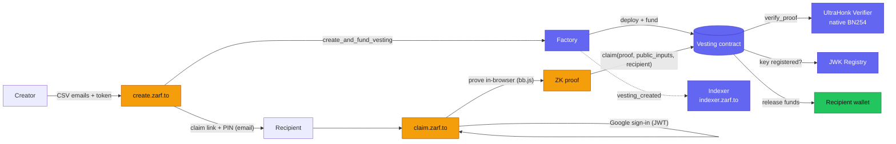

Zarf is a privacy-first token distribution protocol on Stellar/Soroban. It ships
two product families that share one contract stack and one core library:

- **Email (ZK) distributions** — a creator uploads a CSV of emails; only a Merkle
  root of the audience goes on-chain. Recipients claim with a Google login and an
  in-browser zero-knowledge proof, verified on-chain by an UltraHonk verifier.
- **Wallet airdrops** — classic address-whitelist distributions over the same
  vesting engine, with no ZK and a strict Content-Security-Policy.

> **Status:** Zarf runs on Stellar **testnet** only today. Mainnet launch is
> deliberately gated on a third-party audit — see
> [project status](/resources/project-status/).

## System map

The email/ZK path spans the browser, three Cloudflare Workers, and four Soroban
contracts. The create side funds a vesting contract through the Factory; the
claim side proves eligibility in the recipient's browser and the Vesting contract
verifies that proof before releasing funds.

<!-- TODO(screenshot): optional — replace/augment with the polished diagrams/ SVG once exported -->

## Components

### Contracts (`contracts/soroban/`)

Four Rust/Soroban contracts. Full signatures, events, and storage keys are on the
[contracts reference](/developers/contracts/).

- **Factory** — deploys vesting contracts deterministically
  (`env.deployer().with_current_contract(salt).deploy_v2(...)`) and funds them in
  one call. Stores the verifier address, JWK registry address, and vesting Wasm
  hash. Factory governance can timelock a verifier-address rotation for future
  vestings after a new immutable verifier is deployed and fixture-gated; the
  rotation entrypoint does not mutate existing vesting verifier addresses.
  Exposes `recipient_id(recipient)` so a Stellar-bound proof can be generated
  before the vesting instance exists.
  (`contracts/soroban/zarf/factory`)
- **Vesting** — holds funds, records the Merkle root and audience hash (the
  per-recipient unlock times are baked into the Merkle leaves, not stored as a
  separate schedule), and runs the claim path:
  `claim(proof, public_inputs, recipient)` with `recipient.require_auth()`.
  (`contracts/soroban/zarf/vesting`)
- **UltraHonk Verifier** — stores the Noir verification key at deploy time
  (immutable) and exposes `verify_proof(public_inputs, proof_bytes)`. Verifies the
  UltraKeccakHonk proof layout (bb.js v2.1.9) using Soroban's native BN254 host
  functions. (`contracts/soroban/verifier`)
- **JWK Registry** — the on-chain mirror of Google's trusted signing-key hashes;
  the Vesting contract checks a proof's key against it. Kept fresh by the
  `jwk-rotation` worker. (`contracts/soroban/zarf/jwk-registry`)

### Apps and origins

The web monorepo lives under `web/apps` with shared code in `web/packages`. The
core cryptography, ZK proving, and Stellar wiring live in `@zarf/core`
(`web/packages/core`); shared Svelte chrome lives in `@zarf/ui`.

| Origin | App(s) | Role | CSP posture | Source |
|---|---|---|---|---|
| `zarf.to` | `@zarf/landing` | Chooser / redirect shell; never touches JWT, PIN, or claim link | strict | `web/apps/landing` |
| `create.zarf.to` | `@zarf/create` | ZK email distributions — create only, **email-only** | `wasm-unsafe-eval`, no `unsafe-eval` | `web/apps/create/src` |
| `claim.zarf.to` | `@zarf/claim` | ZK email claim (UltraHonk prover + Google JWT) — most isolated | `wasm-unsafe-eval`, no `unsafe-eval`; + Google JWT | `web/apps/claim/src` |
| `airdrop.zarf.to` | `@zarf/airdrop-create`, `@zarf/airdrop-claim` | Wallet address-whitelist airdrops (create + claim), no ZK | strict, no eval | `web/apps/airdrop-create`, `web/apps/airdrop-claim` |

<!-- TODO(verify): airdrop.zarf.to is the ratified target origin (plans/origin-split-impl.md). That plan is "PLAN ONLY — not yet executed": today the wallet flow is two separate apps (airdrop-create / airdrop-claim); the plan merges them into one worker (zarf-airdrop) at airdrop.zarf.to. README's live deploy list currently ships only landing/create/claim/pin-proxy/jwk-rotation. -->

<!-- TODO(verify): CSP posture column — at HEAD 3be14ec (PR #9) create.zarf.to and claim.zarf.to ship the SAME eval-free script-src ('self' 'wasm-unsafe-eval' 'blob:' https://static.cloudflareinsights.com); there is no 'unsafe-eval' anywhere in web/ source (commit: "strict nonces, no unsafe-inline/eval"). The two airdrop apps currently ship no custom CSP at all, so "strict, no eval" is the plan's target, not current source. See the origin-split note below. -->

### Supporting services

| Service | Deployment | Role | Source |
|---|---|---|---|
| Indexer | `indexer.zarf.to` (worker `zarf-indexer`) | Read API: active distributions and claim state; edge-cached | `web/apps/indexer` |
| pin-proxy | worker `zarf-pin-proxy` | IPFS pinning (Pinata) with CID re-verification | `web/apps/pin-proxy` |
| JWK rotation | `jwt.zarf.to` (worker `zarf-jwk-rotation`) | Syncs Google's JWKS into the JWK Registry on a `0 */6 * * *` cron | `web/apps/jwk-rotation` |
| Docs | `docs.zarf.to` | This documentation site | `web/apps/docs` |

The indexer and pin-proxy are read-side conveniences, not custody: they can never
move funds. See [indexer API](/developers/indexer-api/),
[IPFS & metadata](/developers/ipfs-and-metadata/), and
[JWK rotation](/developers/jwk-rotation/).

## The origin split (a security story)

The browser's security boundary is the **origin**. Zarf splits origins by
**security posture — eval vs no-eval — not by create-vs-claim**. The felt sense of
one product comes from a shared chooser and shared `@zarf/ui` chrome, not from
merging origins.

<!-- TODO(verify): the "eval vs no-eval" framing here (and the two bullets below)
follows plans/origin-split-impl.md and the project memory, but is contradicted by
current source. At HEAD 3be14ec (PR #9), BOTH create.zarf.to AND claim.zarf.to
ship an identical eval-free script-src ('self' 'wasm-unsafe-eval' 'blob:'
https://static.cloudflareinsights.com) — there is no 'unsafe-eval' anywhere in
web/ source. If that CSP holds at runtime, the split can no longer be justified by
an eval-posture asymmetry; it still stands on blast-radius isolation and JWT/PIN
handling. Reconcile this section with the security owners (and confirm what is
actually deployed — PR #9's web apps are deploy-gated). -->

Why it matters:

- **`claim.zarf.to` isolates the ZK prover.** The prover pulls in
  `@noir-lang/acvm_js` and the bb.js WASM (see [the ZK stack](/developers/zk-stack/))
  and runs only here. In current source its `script-src` is eval-free
  (`'wasm-unsafe-eval'`, no `'unsafe-eval'`); isolating the prover and the Google
  JWT/PIN handling on their own origin keeps the blast radius contained
  regardless. <!-- TODO(verify): plan/memory say acvm_js REQUIRES 'unsafe-eval'; PR #9 dropped it from the CSP. Confirm the eval-free CSP proves end-to-end, and note the deployed origin may still run the older 'unsafe-eval' header (see zk-stack). -->
- **An eval-allowing origin co-hosted with a hardened one defeats the
  hardening.** If a strict page shared an origin with an eval page, a pivot from
  the weaker page would undo the stricter page's protections. Separate origins
  keep the blast radius contained.
- **Both families resist claim redirection.** A wallet airdrop bakes the recipient
  into the Merkle leaf plus `claimant.require_auth` and pays out to the claimant,
  so a claim **cannot be redirected** — it is contract-protected. In current source
  a ZK vesting claim is likewise redirect-resistant: PR #9's circuit binds the
  recipient into the Google-signed id_token via the OIDC `nonce`
  (`assert_nonce_binds_recipient`), so a stolen JWT + PIN can only ever prove for
  the wallet the victim requested (see [the ZK stack](/developers/zk-stack/)). The
  ZK claim origin is still held to the highest isolation as defense-in-depth.
  <!-- TODO(verify): the earlier plan/memory framing treated the ZK claim as redirectable (recipient a free input); PR #9's OIDC-nonce binding closes that path in source. Confirm the deployed testnet circuit carries the nonce-binding VK — PR #9's on-chain cutover is deploy-gated. -->

`create.zarf.to`'s ZK create path runs **eval-free**: its Merkle-tree building uses
bb.js Pedersen hashing, which does not require `unsafe-eval`. In current source its
`script-src` is `'self' 'wasm-unsafe-eval' 'blob:' https://static.cloudflareinsights.com`
with no `'unsafe-eval'` and no `cdn.jsdelivr` (`web/apps/create/svelte.config.js`).

<!-- Note: PR #9 (HEAD 3be14ec) already narrowed create's CSP to the eval-free header via SvelteKit kit.csp; the pre-PR#9 'unsafe-eval' + cdn.jsdelivr header described in plans/origin-split-impl.md is no longer present in source. -->

For the threat-model consequences of this split, see the
[security model](/developers/security-model/).

## Data flow: create → fund → email → claim → verify → release

1. **Create.** The creator uploads a CSV of emails, picks a token, and sets a
   schedule at `create.zarf.to`. In the browser, `@zarf/core` derives a Pedersen
   leaf per recipient, builds the Merkle tree, and generates a per-recipient PIN.
   Only the `merkle_root` and an `audience_hash` leave the browser as public data;
   the emails and PINs never do.
2. **Pin metadata.** Distribution metadata is pinned to IPFS through pin-proxy,
   which returns a `metadata_cid`. pin-proxy re-hashes the gateway bytes to confirm
   the CID (see [IPFS & metadata](/developers/ipfs-and-metadata/)).
3. **Deploy + fund.** The creator signs `create_and_fund_vesting(...)` on the
   Factory, which deterministically deploys a Vesting contract and transfers the
   token funding into it in one call, emitting `vesting_created`. (Funding here is
   a direct `transfer_from`; the `deposited` event belongs to the Vesting
   contract's separate owner-only `deposit` top-up entrypoint.)
4. **Email.** The creator downloads `secrets.csv` (email + PIN per recipient) and
   emails each recipient a claim link (the vesting address) and their PIN.
5. **Claim.** The recipient opens the link at `claim.zarf.to`, signs in with
   Google (yielding a signed JWT containing their email), enters the PIN, and the
   browser generates an UltraHonk proof (~60–90s). The email, JWT, PIN, and the
   wallet↔email link never leave the browser.
6. **Verify.** The recipient submits `claim(proof, public_inputs, recipient)` to
   the Vesting contract. Vesting checks the proof's Google key against the JWK
   Registry, calls the Verifier's `verify_proof` (native BN254), and confirms the
   recipient commitment has not already claimed.
7. **Release.** Vesting marks the claim and transfers the tokens to the recipient's
   wallet, emitting `claimed`. A claim costs roughly **0.0225 XLM** on testnet.

The privacy consequences of each step — what is public versus off-chain — are laid
out in the [privacy model](/learn/privacy-model/).

## Where to go next

- [The ZK stack](/developers/zk-stack/) — what the circuit proves and how it runs on Soroban.
- [Contracts reference](/developers/contracts/) — signatures, events, and storage.
- [Indexer API](/developers/indexer-api/) — reading distribution and claim state.
- [Security model](/developers/security-model/) — trust boundaries and known issues.
- [Self-hosting](/developers/self-hosting/) — run the whole stack yourself.
