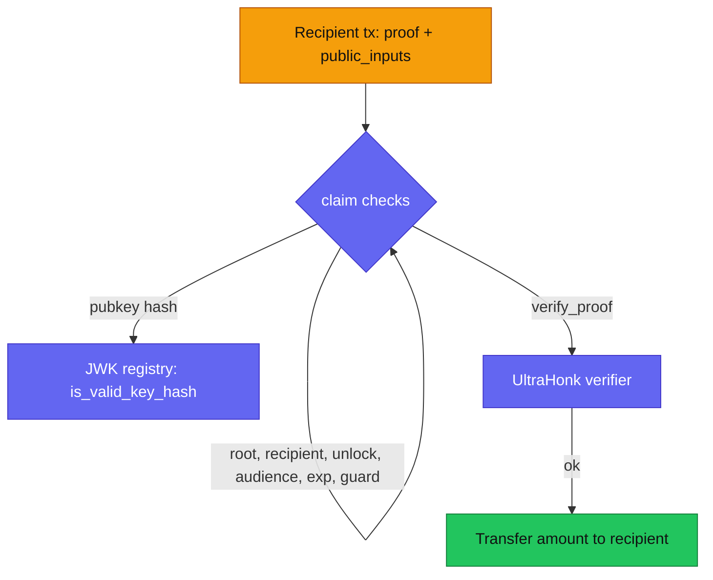

Zarf's on-chain implementation is Stellar/Soroban only. Four contracts make up
the ZK (email) distribution system, all under `contracts/soroban/`:

| Contract | Crate | Role |
|---|---|---|
| Factory | `zarf/factory` | Deploys vesting contracts deterministically and tracks them |
| Vesting | `zarf/vesting` | Holds funds, stores the audience root, verifies claims, pays out |
| UltraHonk Verifier | `verifier` | Verifies UltraHonk proofs on-chain using native BN254 |
| JWK Registry | `zarf/jwk-registry` | Stores hashes of trusted Google signing keys |

Every signature, event, error, and storage key below is taken from the Rust
source. Field indices and constants are quoted from the contract modules
directly.

The wallet-airdrop product (`airdrop.zarf.to`) runs on a separate airdrop
contract family and is not covered here; see the
[architecture overview](/developers/architecture/).

:::note[Testnet only]
These contracts are deployed to Stellar **testnet** today. Mainnet is
deliberately gated on a third-party audit — see
[project status](/resources/project-status/) and
[deployed contracts](/resources/deployed-contracts/).
:::

## Shared conventions

- **Field elements** are `BytesN<32>` interpreted as big-endian BN254 scalars.
  The factory and vesting contracts reject any 32-byte value that is not below
  the BN254 scalar modulus (`is_canonical_field`), so a Merkle root, audience
  hash, or public input must be a canonical field element.
- **`recipient_id`** maps a Stellar `Address` into the circuit's field domain:
  `BnScalar::from_bytes(keccak256(recipient.to_xdr()))`. Both the factory and
  the vesting contract expose this helper, and they compute it identically.
- **TTL (rent) management.** The factory, vesting, and registry contracts all
  define `DAY_IN_LEDGERS = 17_280` (~5s ledgers), `TTL_EXTEND_TO = 120 *
  DAY_IN_LEDGERS` (~120 days, under the ~180-day network maximum), and
  `TTL_THRESHOLD = TTL_EXTEND_TO - DAY_IN_LEDGERS`. Every state-changing call
  re-extends the instance, code, and touched persistent entries. A fully
  dormant contract still needs an external `ExtendFootprintTTLOp` before the
  window lapses. See [operational notes](/creators/operational-notes/).

---

## Factory — `ZarfVestingFactoryContract`

Deploys vesting and wallet-airdrop contracts at deterministic addresses. Vesting
deployments keep the existing global/per-owner registry; airdrops use a separate
flat registry so vesting discovery does not treat airdrops as ZK/email
campaigns.

### Constructor

```rust
fn __constructor(
    env: Env,
    verifier: Address,
    jwk_registry: Address,
    vesting_wasm_hash: BytesN<32>,
    airdrop_wasm_hash: BytesN<32>,
)
```

The factory is initialized once with the addresses it will inject into every
vesting contract it deploys, plus the WASM hash of the vesting contract to
deploy. It also records the airdrop WASM hash used by `create_airdrop`.

### Deterministic addresses

```rust
fn predict_vesting_address(env: Env, owner: Address, salt: BytesN<32>) -> Address
fn predict_airdrop_address(env: Env, owner: Address, salt: BytesN<32>) -> Address
```

The deployment salt is owner-bound: `keccak256(owner.to_xdr() || salt)`. The
address is derived with `env.deployer().with_current_contract(deployment_salt)`,
so `predict_vesting_address` returns exactly the address a subsequent
`create_vesting`/`create_and_fund_vesting` with the same `(owner, salt)` will
produce. This lets callers compute the vesting address before the transaction
lands.

Airdrops use the same owner-bound pattern with an airdrop domain separator, so
the same `(owner, salt)` cannot collide with a vesting address.

### Creating a distribution

```rust
fn create_vesting(
    env: Env, owner: Address, token: Address, salt: BytesN<32>,
    name: String, description: String,
    merkle_root: BytesN<32>, audience_hash: BytesN<32>,
    recipient_count: u32, total_amount: i128, metadata_cid: String,
) -> Result<Address, Error>

fn create_and_fund_vesting(/* identical parameters */) -> Result<Address, Error>
```

Both require `owner.require_auth()`, validate the metadata (`recipient_count >
0`, `total_amount >= 0`), validate the initial root (canonical field, or zero
if not yet funded), and require a non-zero canonical `audience_hash`. They
deploy the vesting contract with `deploy_v2` and record a `DeploymentInfo`.

`create_and_fund_vesting` additionally moves `total_amount` of `token` from the
owner into the freshly deployed vesting contract via `transfer_from`, so the
owner must have approved the factory as spender for that amount beforehand. It
requires `total_amount > 0` and asserts the received balance matches (else
`TokenTransferMismatch`). `create_vesting` leaves the contract unfunded (deposit
later with the vesting contract's `deposit`).

`metadata_cid` is the IPFS CID of the pinned claim list; see
[IPFS & metadata](/developers/ipfs-and-metadata/).

### Creating a wallet airdrop

```rust
fn create_airdrop(
    env: Env, owner: Address, token: Address,
    merkle_root: BytesN<32>, total: i128, deadline: u64, locked: bool,
    recipient_count: u32, salt: BytesN<32>, metadata_cid: String,
) -> Result<Address, Error>
```

`create_airdrop` requires `owner.require_auth()`, rejects a zero root, validates
`recipient_count > 0`, `total > 0`, `total >= recipient_count`, and rejects a
past non-zero deadline. It deploys the airdrop instance with `deploy_v2`, pulls
`total` from the owner via `transfer_from`, verifies the credited balance, and
emits `AirdropCreated`.

### Read functions

```rust
fn verifier(env: Env) -> Result<Address, Error>
fn jwk_registry(env: Env) -> Result<Address, Error>
fn vesting_wasm_hash(env: Env) -> Result<BytesN<32>, Error>
fn airdrop_wasm_hash(env: Env) -> Result<BytesN<32>, Error>
fn recipient_id(env: Env, recipient: Address) -> BytesN<32>
fn vesting_metadata_cid(env: Env, vesting: Address) -> Result<String, Error>

fn get_deployment_count(env: Env) -> u32
fn get_deployment(env: Env, index: u32) -> Result<Address, Error>
fn get_deployments(env: Env, start: u32, limit: u32) -> Result<Vec<Address>, Error>
fn get_deployment_info(env: Env, index: u32) -> Result<DeploymentInfo, Error>
fn get_deployment_infos(env: Env, start: u32, limit: u32) -> Result<Vec<DeploymentInfo>, Error>

fn get_owner_deployment_count(env: Env, owner: Address) -> u32
fn get_owner_deployment(env: Env, owner: Address, index: u32) -> Result<Address, Error>
fn get_owner_deployments(env: Env, owner: Address, start: u32, limit: u32) -> Result<Vec<Address>, Error>
fn get_owner_deployment_info(env: Env, owner: Address, index: u32) -> Result<DeploymentInfo, Error>
fn get_owner_deployment_infos(env: Env, owner: Address, start: u32, limit: u32) -> Result<Vec<DeploymentInfo>, Error>

fn get_airdrop_deployment_count(env: Env) -> u32
fn get_airdrop_deployment(env: Env, index: u32) -> Result<Address, Error>
```

`DeploymentInfo { address: Address, metadata_cid: String }`. Range reads are
capped at `MAX_PAGE_LIMIT = 80` items (`InvalidLimit` otherwise); the cap counts
ledger entries, not bytes, to stay under the network's ~100-entry footprint
limit per transaction. In practice most integrators read these through the
[indexer](/developers/indexer-api/) rather than simulating directly.

### Event

```rust
#[contractevent(topics = ["vesting_created"])]
struct VestingCreated {
    #[topic] vesting: Address,
    #[topic] owner: Address,
    #[topic] token: Address,
    total_amount: i128,
    recipient_count: u32,
    metadata_cid: String,
}
```

### Errors

| Value | Error | Meaning |
|---|---|---|
| 1 | `NotInitialized` | Instance storage key missing |
| 2 | `InvalidRecipientCount` | `recipient_count == 0` |
| 3 | `InvalidAmount` | Negative amount, or zero when funding is required |
| 4 | `InvalidLimit` | Range `limit` exceeds `MAX_PAGE_LIMIT` |
| 5 | `InvalidMerkleRoot` | Root non-canonical, or zero when funding is required |
| 6 | `InvalidAudience` | Audience hash zero or non-canonical |
| 7 | `TokenTransferMismatch` | Post-transfer balance did not match |

### Storage keys

`Verifier`, `JwkRegistry`, `VestingWasmHash`, `DeploymentCount` (instance);
`DeploymentAt(u32)`, `OwnerDeploymentCount(Address)`,
`OwnerDeploymentAt(Address, u32)`, `MetadataCid(Address)` (persistent, TTL-extended).

<!-- TODO(verify): factory footprint / deploy fixes merged 2026-06-12 may not be on the deployed testnet WASM; see resources/deployed-contracts WASM-lag note -->

---

## Vesting — `ZarfVestingContract`

Holds the distribution's funds, stores the audience Merkle root and audience
hash, and releases tokens to a recipient once an on-chain proof is verified.

### Constructor

```rust
fn __constructor(
    env: Env, owner: Address, token: Address,
    verifier: Address, jwk_registry: Address,
    name: String, description: String,
    merkle_root: BytesN<32>, audience_hash: BytesN<32>, metadata_cid: String,
) -> Result<(), Error>
```

Deployed by the factory (never called directly). Validates the initial root and
a non-zero canonical `audience_hash`.

### `claim`

```rust
fn claim(env: Env, proof: Bytes, public_inputs: Bytes, recipient: Address) -> Result<(), Error>
```

Requires `recipient.require_auth()`, then, in order:

1. `public_inputs.len()` must equal `25 * 32` bytes (`PUBLIC_INPUT_FIELDS = 25`,
   `FIELD_BYTES = 32`), and every field must be canonical.
2. The pubkey hash — `keccak256` of the first 18 fields (`PUBKEY_LIMBS = 18`) —
   must be a valid key in the JWK registry (cross-contract call to
   `is_valid_key_hash`). Otherwise `InvalidPubkey`.
3. The stored Merkle root must be set and canonical, and must equal the proof's
   root field. Otherwise `InvalidMerkleRoot`.
4. The proof's recipient field must equal `recipient_id(recipient)`. Otherwise
   `InvalidRecipient`.
5. `ledger.timestamp() >= unlock_time` or `EpochLocked`.
6. The proof's audience field must equal the stored `audience_hash` or
   `InvalidAudience`.
7. `ledger.timestamp() <= jwt_exp` or `JwtExpired`.
8. The epoch commitment must not already be claimed or `AlreadyClaimed`.
9. The `Claimed(epoch_commitment)` guard is set to `true`, then the proof is
   verified via the verifier contract (`verify_proof`). If verification fails
   the guard is reset to `false` and `InvalidProof` is returned.
10. `amount` (decoded from the amount field) of `token` is transferred to the
    recipient, with a balance-delta assertion (`TokenTransferMismatch` reverts
    the guard).

The public-input field layout the contract reads:

| Index | Field | Constant |
|---|---|---|
| 0–17 | Google RSA pubkey limbs | `PUBKEY_LIMBS = 18` |
| 18 | Merkle root | `ROOT_INDEX` |
| 19 | Unlock time | `UNLOCK_TIME_INDEX` |
| 20 | Epoch commitment | `EPOCH_COMMITMENT_INDEX` |
| 21 | Recipient id | `RECIPIENT_INDEX` |
| 22 | Amount | `AMOUNT_INDEX` |
| 23 | Audience hash | `AUDIENCE_HASH_INDEX` |
| 24 | JWT expiry | `JWT_EXP_INDEX` |

See [the ZK stack](/developers/zk-stack/) for how these public inputs are
produced by the circuit.



### Owner and setup functions

```rust
fn transfer_ownership(env: Env, new_owner: Address) -> Result<(), Error>
fn set_merkle_root(env: Env, merkle_root: BytesN<32>) -> Result<(), Error>
fn deposit(env: Env, amount: i128) -> Result<(), Error>
```

- `set_merkle_root` is a one-time transition: it only succeeds when the current
  root is zero, and rejects with `MerkleRootAlreadySet` afterwards. It supports
  the "create unfunded, set root later" flow.
- `deposit` requires owner auth, a set canonical root, and `amount > 0`; it
  pulls tokens via `transfer_from` (owner must have approved the vesting
  contract) and asserts the balance delta.

### Read functions

```rust
fn owner(env) / token(env) / verifier(env) / jwk_registry(env) -> Result<Address, Error>
fn name(env) / description(env) / metadata_cid(env) -> Result<String, Error>
fn merkle_root(env) / audience_hash(env) -> Result<BytesN<32>, Error>
fn summary(env: Env) -> Result<VestingSummary, Error>
fn recipient_id(env: Env, recipient: Address) -> BytesN<32>
fn is_claimed(env: Env, epoch_commitment: BytesN<32>) -> bool
fn claimed_statuses(env: Env, epoch_commitments: Vec<BytesN<32>>) -> Result<Vec<bool>, Error>
```

`claimed_statuses` batches claim-guard lookups (one simulation for a whole epoch
chain) and is capped at `MAX_CLAIMED_BATCH = 64` (`TooManyCommitments`). An
archived guard reads as `false` here, exactly like `is_claimed`; the on-chain
`claim` still rejects after a restore. The [indexer](/developers/indexer-api/)
reads the guard entries directly via `getLedgerEntries` and does not need this
call — it exists for integrators without an indexer.

### Events

```rust
OwnershipTransferred  // topics ["owner_set"]
MerkleRootSet         // topics ["merkle_root_set"]
Deposited { amount: i128 }                       // topics ["deposited"]
Claimed {                                        // topics ["claimed"]
    #[topic] epoch_commitment: BytesN<32>,
    #[topic] recipient: Address,
    amount: i128,
}
```

### Errors

| Value | Error | | Value | Error |
|---|---|---|---|---|
| 1 | `InvalidProof` | | 9 | `InvalidAmount` |
| 2 | `InvalidMerkleRoot` | | 10 | `NotInitialized` |
| 3 | `InvalidRecipient` | | 11 | `MerkleRootAlreadySet` |
| 4 | `InvalidPubkey` | | 12 | `MerkleRootFunded` |
| 5 | `AlreadyClaimed` | | 13 | `InvalidAudience` |
| 6 | `EpochLocked` | | 14 | `JwtExpired` |
| 7 | `Unauthorized` | | 15 | `TokenTransferMismatch` |
| 8 | `InvalidPublicInputs` | | 16 | `TooManyCommitments` |

### Storage keys

`Owner`, `Token`, `Verifier`, `JwkRegistry`, `Name`, `Description`,
`MerkleRoot`, `AudienceHash`, `MetadataCid` (instance); `Claimed(BytesN<32>)`
(persistent, one entry per claimed epoch commitment).

:::caution[No owner sweep]
The vesting contract has **no function to withdraw unclaimed funds**. There is
no owner sweep or refund path: once tokens are deposited, only a valid claim can
move them out. Fund only what you can afford to lock, and see
[costs & funding](/creators/costs-and-funding/) and
[operational notes](/creators/operational-notes/). Tracked as issue 003 in the
[security model](/developers/security-model/).
:::

---

## UltraHonk Verifier — `UltraHonkVerifierContract`

Verifies UltraHonk proofs entirely on-chain. The vesting contract calls it
during `claim`.

### Functions

```rust
fn __constructor(env: Env, vk_bytes: Bytes, vk_hash: BytesN<32>) -> Result<(), Error>
fn vk_hash(env: Env) -> Result<BytesN<32>, Error>
fn verify_proof(env: Env, public_inputs: Bytes, proof_bytes: Bytes) -> Result<(), Error>
```

The verification key is set once at deploy time and stored in instance storage
(keys `vk` and `vk_hash`). `verify_proof` re-parses the stored VK, checks
`proof_bytes.len()` against the verifier's `expected_proof_bytes()`
(`ProofParseError` on mismatch), and runs verification.

Verification uses Soroban's **native BN254 host functions** — the elliptic-curve
work (`env.crypto().bn254()`: `bn254_g1_msm` per CAP-0080 / Protocol 26+, and
`pairing_check`) runs as host primitives rather than in WASM, which is what
keeps a full UltraHonk proof within Soroban's per-transaction budget. A ZK
claim measured **~0.0225 XLM on testnet** end to end. See
[the ZK stack](/developers/zk-stack/) for the proving side.

### Errors

| Value | Error |
|---|---|
| 1 | `VkParseError` |
| 2 | `ProofParseError` |
| 3 | `VerificationFailed` |
| 4 | `VkNotSet` |

:::note
The `__constructor` stores the caller-supplied `vk_hash` verbatim without
recomputing `keccak(vk_bytes)`. This is deploy-time integrity only (the hash is
bound into the Fiat–Shamir transcript, so a mismatch breaks verification rather
than weakening it) and is tracked as issue 004 in the
[security model](/developers/security-model/).
:::

---

## JWK Registry — `JwkRegistryContract`

Stores hashes of the Google RSA signing keys that the JWT circuit trusts. Kept
fresh by the [JWK rotation worker](/developers/jwk-rotation/).

The contract splits roles. The **owner** (intended to be a cold multisig) can
register or revoke keys immediately, cancel pending proposals, set the operator,
and hand over ownership. The **operator** (the hot rotation worker) can only
*propose* a key — which becomes valid only after `activation_delay_secs` elapses
and anyone calls `activate_key` — and revoke keys (fail-safe: it can only ever
disable keys, never enable them ahead of the delay). The activation delay is the
monitoring window in which the owner can `cancel_pending` a malicious proposal.

<!-- NOTE(WASM lag): this owner/operator timelock model is the current contract
source. The deployed testnet registry may still run the earlier single-owner
WASM (the rotation worker's REGISTRY_V2 flag defaults off) — see the WASM-lag
note under resources/deployed-contracts. -->

### Functions

```rust
fn __constructor(env: Env, owner: Address, activation_delay_secs: u64) -> Result<(), Error>
fn owner(env: Env) -> Address

// Two-step ownership handover
fn propose_owner(env: Env, new_owner: Address)                 // owner
fn accept_ownership(env: Env) -> Result<(), Error>             // pending owner
fn cancel_ownership_transfer(env: Env) -> Result<(), Error>    // owner
fn pending_owner(env: Env) -> Option<Address>

// Operator (hot rotation key)
fn set_operator(env: Env, operator: Address)                   // owner
fn get_operator(env: Env) -> Option<Address>
fn get_activation_delay(env: Env) -> u64

// Key lifecycle
fn register_key(env: Env, kid: String, pubkey_limbs: Vec<BytesN<32>>) -> Result<BytesN<32>, Error>  // owner, immediate
fn propose_key(env: Env, kid: String, pubkey_limbs: Vec<BytesN<32>>) -> Result<BytesN<32>, Error>   // operator, timelocked
fn activate_key(env: Env, key_hash: BytesN<32>) -> Result<(), Error>                                // permissionless once delay elapses
fn cancel_pending(env: Env, key_hash: BytesN<32>) -> Result<(), Error>                              // owner
fn revoke_key(env: Env, key_hash: BytesN<32>) -> Result<(), Error>                                  // owner, immediate
fn operator_revoke_key(env: Env, key_hash: BytesN<32>) -> Result<(), Error>                         // operator, immediate

// Reads
fn is_valid_key_hash(env: Env, key_hash: BytesN<32>) -> bool
fn is_valid_key(env: Env, pubkey_limbs: Vec<BytesN<32>>) -> Result<bool, Error>
fn compute_key_hash(env: Env, pubkey_limbs: Vec<BytesN<32>>) -> Result<BytesN<32>, Error>
fn get_registered_key_count(env: Env) -> u32
fn get_registered_key(env: Env, index: u32) -> Result<BytesN<32>, Error>
fn is_kid_registered(env: Env, kid: String) -> bool
fn get_pending(env: Env, key_hash: BytesN<32>) -> Option<PendingKey>
fn get_pending_count(env: Env) -> u32
fn get_pending_at(env: Env, index: u32) -> Result<BytesN<32>, Error>
```

A key is 18 limbs (`PUBKEY_LIMBS = 18`) of `BytesN<32>`; its hash is
`keccak256` of the packed 576 bytes (`InvalidKeyLength` for any other count).
This is the same hash the vesting contract's `claim` computes from the proof's
first 18 public-input fields, so registration and verification agree by
construction. Both `register_key` and `propose_key` also validate that the limbs
form a 2048-bit odd RSA modulus (`InvalidModulus` otherwise). `register_key` is
idempotent for a known key (it reuses the enumeration slot and re-extends TTL);
re-registering the same `kid` with a new pubkey adds the new hash without
revoking the old one. The activation delay is range-checked at construction to
`MIN_ACTIVATION_DELAY_SECS = 6 * 3600` .. `MAX_ACTIVATION_DELAY_SECS = 7 * 24 *
3600` (`InvalidActivationDelay`).

### Events

```rust
OwnershipTransferred { #[topic] previous_owner, #[topic] new_owner }  // topics ["owner_set"]
OwnerProposed { #[topic] new_owner: Address }                         // topics ["owner_proposed"]
OperatorSet { #[topic] operator: Address }                            // topics ["operator_set"]
KeyRegistered { #[topic] key_hash: BytesN<32>, kid: String }          // topics ["key_registered"]
KeyProposed { #[topic] key_hash: BytesN<32>, kid: String, activate_after: u64 }  // topics ["key_proposed"]
KeyActivated { #[topic] key_hash: BytesN<32> }                        // topics ["key_activated"]
PendingCancelled { #[topic] key_hash: BytesN<32> }                    // topics ["pending_cancelled"]
KeyRevoked { #[topic] key_hash: BytesN<32> }                          // topics ["key_revoked"]
```

### Errors

| Value | Error |
|---|---|
| 1 | `Unauthorized` |
| 2 | `InvalidKeyLength` |
| 3 | `KeyNotFound` |
| 4 | `OperatorNotSet` |
| 5 | `PendingNotFound` |
| 6 | `ActivationDelayNotElapsed` |
| 7 | `InvalidModulus` |
| 8 | `InvalidActivationDelay` |
| 9 | `PendingOwnerNotSet` |

### Storage keys

`Owner`, `PendingOwner`, `Operator`, `ActivationDelay`, `KeyCount`,
`PendingCount` (instance); `Key(BytesN<32>)`, `Kid(String)`, `KeyAt(u32)`,
`KeyIndex(BytesN<32>)`, `Pending(BytesN<32>)`, `PendingAt(u32)`,
`PendingIndex(BytesN<32>)` (persistent). `KeyIndex` is a reverse lookup
(hash → enumeration index) so re-registration and revocation can re-extend the
`KeyAt` entry's TTL without scanning; `PendingIndex` does the same for the
pending-proposal enumeration.

:::caution[Fail-open on stale keys]
`is_valid_key_hash` returns `true` for any registered, non-revoked hash
**indefinitely** — there is no on-chain validity window. Removing a rotated-out
key depends entirely on the off-chain rotation job calling `revoke_key` (or
`operator_revoke_key`). Treat that job as security-critical. Tracked as issue 002 in the
[security model](/developers/security-model/) and
[trust assumptions](/learn/trust-assumptions/).
:::

---

## Building and testing

From the repo root (see `contracts/README.md`):

```sh
cargo test --manifest-path contracts/soroban/verifier/Cargo.toml
cargo test --manifest-path contracts/soroban/zarf/jwk-registry/Cargo.toml
cargo test --manifest-path contracts/soroban/zarf/vesting/Cargo.toml
cargo test --manifest-path contracts/soroban/zarf/factory/Cargo.toml

cargo build --manifest-path contracts/soroban/zarf/vesting/Cargo.toml \
  --target wasm32v1-none --release
```

Deployed testnet addresses are listed under
[deployed contracts](/resources/deployed-contracts/). To run the full stack
yourself, see [self-hosting](/developers/self-hosting/).
