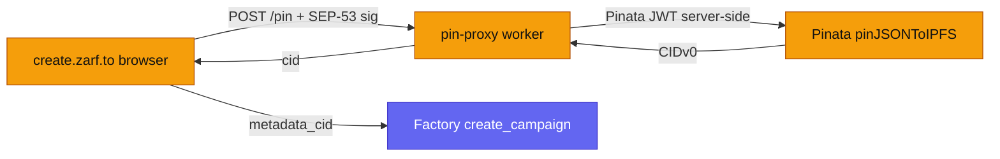

An email (ZK) distribution stores only a Merkle root and an audience hash
on-chain. Everything a claim app needs to reconstruct proofs and check
eligibility — the Merkle leaves, per-recipient commitments, the schedule, and
email hashes — lives in an off-chain JSON document pinned to IPFS. Its
CID is recorded on-chain, and every consumer re-hashes the fetched bytes against
that CID so a compromised gateway cannot swap the content.

## What gets pinned

The pinned document is the **claim list** built by
`web/packages/core/lib/domain/claimListBuilder.ts`:

```json
{
  "merkleRoot": "0x…",
  "schedule": {
    "vestingStart": 0, "cliffDuration": 0, "vestingDuration": 0,
    "vestingPeriod": 0, "totalPeriods": 0
  },
  "leaves": ["0x…"],
  "commitments": { "0x<identityCommitment>": { "amount": "…", "unlockTime": 0, "index": 0 } },
  "emailHashes": ["0x…"],
  "totalAmount": "…"
}
```

- `emailHashes` are Pedersen hashes of the normalized recipient emails, sorted.
  They gate eligibility filtering without revealing addresses; a document with
  no email gating omits them (the indexer reports `null`). See the
  [privacy model](/learn/privacy-model/).
- `commitments` maps each identity commitment to its amount/unlock (an array
  when one identity has multiple vesting epochs).
- The `schedule` is the source of truth for vesting timing — the on-chain
  contract does not store it (which is why the [indexer](/developers/indexer-api/)
  returns schedule fields as `"0"`).
- `totalAmount` is the sum of all claim amounts (base units, decimal string), so
  clients can compare the advertised allocation against the vesting contract's
  live balance. It is optional — documents pinned before the field was added
  omit it.

**Determinism is load-bearing.** `serializeClaimList` writes keys in a fixed
order so the same logical content produces byte-identical JSON — and therefore
the same CID. This is what makes "re-pin yields the same CID" hold, and it is
why the CID can be reproduced from the content alone (below).

## The pin flow



The **pin proxy** (`web/apps/pin-proxy/src/index.ts`, route `pin.zarf.to`) is a
stateless worker whose main job is to keep the Pinata JWT server-side so it
never ships to the browser.

- `POST /pin` — validates the claim list (`merkleRoot` and every `leaf` must be
  32-byte hex, `leaves` non-empty, `schedule` an object), authenticates the
  request, forwards it to Pinata's `pinJSONToIPFS`, and returns `{ cid, size }`.
  Pinata returns a **CIDv0** (`Qm…`, dag-pb + UnixFS, kubo defaults).
- `GET /ipfs/:cid` — an open, verified passthrough (see below).
- `GET /health` — `{ "ok": true }`.

Body size is capped by `MAX_BODY_BYTES` (default 1 MiB), and only
`application/json` is accepted.

### Pin authentication

`POST /pin` is authorized by a SEP-53 signed message from the distribution
owner's Stellar key (built in `pinService.ts`, verified in the worker). The
request carries four headers:

| Header | Contents |
|---|---|
| `X-Zarf-Owner` | Owner's Stellar public key (`G…`) |
| `X-Zarf-Issued-At` | Millisecond timestamp |
| `X-Zarf-Body-SHA256` | SHA-256 hex of the exact request body |
| `X-Zarf-Signature` | Signature over the auth message (hex or base64, 64 bytes) |

The worker recomputes the body hash, rejects timestamps outside a 5-minute
window, rebuilds the message (`zarf-pin-v1`, owner, merkleRoot, bodyHash,
issuedAt), hashes it under the `Stellar Signed Message:` SEP-53 prefix, and
verifies the signature against the owner key. Any failure returns
`401 unauthorized_pin` with a `reason`.

## From CID to chain

The CID returned by the pin proxy becomes the `metadata_cid` argument to the
factory's `create_campaign` call (`contracts.ts` → `createAndFundVesting`). The
factory stores it
(`MetadataCid(vesting)`), the vesting contract stores it (`MetadataCid`), and it
is emitted in the `CampaignCreated` event — so a claim app can discover the CID
purely from on-chain data (or via the [indexer](/developers/indexer-api/)).

## CID verification

A public IPFS gateway is just an HTTP server; nothing stops a compromised one
from returning arbitrary bytes for a CID. Content addressing only helps if the
client **re-derives** the CID from the bytes it received. Zarf does this with a
dependency-free module, `web/packages/core/lib/utils/cidVerify.ts`
(`verifyCidAgainstBytes`), shared by the browser apps and both workers (WebCrypto
only — no IPFS libraries, no Node APIs).

For content that fits in a single kubo chunk (`SINGLE_BLOCK_MAX_BYTES =
262_144`), the root dag-pb/UnixFS block is fully reconstructible from the content
bytes, so the CID is verified with nothing but SHA-256:

- **CIDv0** (`Qm…`): base58btc multihash, implicit dag-pb codec. The verifier
  reconstructs `PBNode{ Data: UnixFS{ Type: File, Data, filesize } }` and
  compares `sha256(block)` to the multihash digest.
- **CIDv1 base32** (`b…`): parses version/codec/multihash. `raw` (`0x55`) and
  `json` (`0x0200`) codecs hash the content directly; `dag-pb` (`0x70`) is
  reconstructed as above.

The result is one of three verdicts:

| Verdict | Meaning | Policy |
|---|---|---|
| `verified` | Bytes reproduce the CID's hash | Trust them |
| `mismatch` | Bytes provably do not match | Discard them |
| `unverifiable` | Can't decide from bytes alone (multi-block DAG > 256 KiB, non-sha256 hash, unknown codec) | Caller decides |

The `cidVerify` encoding was validated byte-for-byte against production Pinata
pins.

### Why `unverifiable` is acceptable

Zarf can afford to accept `unverifiable` content (with a logged warning) because
**every security-relevant consumer re-verifies against the on-chain Merkle
root** — the claim itself proves membership in the on-chain root, not in the
gateway's bytes. Tampering with an unverifiable document is therefore bounded to
display spoofing, never to minting a valid claim.

## How claim apps fetch and verify

Reads go through `web/packages/core/lib/utils/ipfsFetch.ts`:

- `fetchIpfsJson(cid)` tries the [indexer](/developers/indexer-api/)
  (`/v1/ipfs/:cid`) first — the shared cache/proxy — then falls back to
  public gateways (Pinata, ipfs.io, dweb.link, w3s.link) if the indexer is
  unavailable. The gateway-fallback path re-runs `verifyCidAgainstBytes`
  client-side before returning, reading with an 8 MiB ceiling and a per-gateway
  timeout; the indexer path relies on the same check applied server-side (below).
- `fetchIpfsEmailHashes(cid)` uses the indexer's `/email-hashes` extraction
  route so eligibility filtering doesn't download the full document per
  distribution.

Both the pin proxy's `/ipfs/:cid` passthrough and the indexer's `/v1/ipfs/:cid`
route apply the same verification server-side before serving bytes onward, and
the pin-proxy passthrough always sets `Content-Type: application/json` with
`X-Content-Type-Options: nosniff` (never the gateway's content type) so pinned
HTML can't render on the Zarf origin. Because clients re-verify anyway, the
original bytes are served unchanged so downstream can re-check.

For the trust story around gateways and pinning availability, see
[trust assumptions](/learn/trust-assumptions/) and the
[security model](/developers/security-model/).
