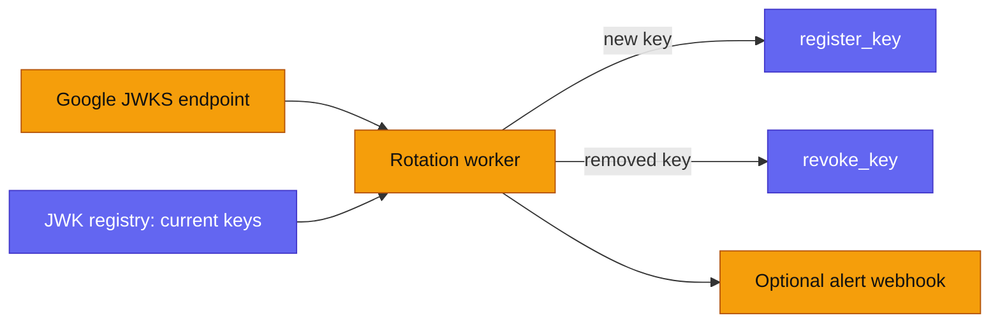

Every email (ZK) claim proves that a Google-signed JWT vouches for the
recipient's account. The proof is only meaningful if the contract knows which
Google signing keys are genuine — that is what the [JWK
registry](/developers/contracts/#jwk-registry--jwkregistrycontract) contract
stores. Google rotates those keys regularly, so a Cloudflare Worker keeps the
on-chain registry in sync.

- **Source:** `web/apps/jwk-rotation/src/index.ts`.
- **Route:** `jwt.zarf.to` (custom domain, from `wrangler.jsonc`).
- **Schedule:** cron `0 */6 * * *` — every 6 hours. Google keys typically rotate
  every couple of weeks, so 6-hourly polling leaves generous overlap.

## Why it matters

The registry is the trust anchor for the whole email flow. If a key the circuit
relied on is missing from the registry, legitimate claims fail; if a key that
Google has retired stays in the registry, a party holding the retired private
key could forge a JWT that still passes the claim's `jwt_exp` check. The worker
exists to keep the registry's key set equal to Google's live set — no more, no
less. See [trust assumptions](/learn/trust-assumptions/).

## What the worker does per run



1. **Fetch** Google's JWKS from `https://www.googleapis.com/oauth2/v3/certs`
   (override with `GOOGLE_JWKS_URL`). Keeps only `RSA` keys with a modulus and
   `use` of `sig` (or unset).
2. **Convert** each RSA modulus into the circuit's key layout: 18 limbs
   (`LIMB_COUNT = 18`) of 120 bits (`LIMB_BITS = 120`), each rendered as a
   32-byte field element. The key hash is `keccak256` of the packed 18×32 bytes
   — exactly the hash the [registry](/developers/contracts/#jwk-registry--jwkregistrycontract)
   and the [vesting `claim`](/developers/contracts/#claim) compute, so all three
   agree by construction.
3. **Read** the registry's current key set on-chain (`get_registered_key_count`
   → `get_registered_key` → `is_valid_key_hash` per index) and diff it against
   the converted Google keys.
4. **Register** any Google key not already active (`register_key`).
5. **Revoke** any active registry key that has dropped out of Google's JWKS
   (`revoke_key`), when `REVOKE_REMOVED_KEYS` is enabled (default `true`).
   Revocation is bounded by safety rails so no single run can brick the
   registry: a Google response with fewer than two valid keys revokes nothing;
   with the `ROTATION_STATE` KV binding a key must stay missing for
   `REVOKE_GRACE_HOURS` before it is revoked; at most `MAX_REVOCATIONS_PER_RUN`
   keys are revoked per run; and revocations never drop the active key count
   below `MIN_ACTIVE_KEYS`.
6. **Report and alert:** log a structured report and, if `ALERT_WEBHOOK_URL` is
   set, POST `{ event, report }` on completion or failure.

The **source of truth for the key set is the on-chain registry**: each run
reconstructs the desired state from Google's live JWKS and the registry's current
on-chain state, keeping no local copy of the keys. `register_key` is idempotent
for already-live keys (the run reports them as `noop`), so re-runs are safe. The
only optional local state is the revocation grace window — when the
`ROTATION_STATE` KV binding is present, the worker records a first-missing
timestamp per key there (cleared when a key reappears); without the binding it
still runs, just without the grace delay.

## HTTP endpoints

All admin endpoints require `Authorization: Bearer <ADMIN_TOKEN>`. If
`ADMIN_TOKEN` is not configured, they return `503 admin_token_not_configured`;
a wrong token returns `401 unauthorized`.

### `GET /health`

No auth. Liveness only — configuration-presence flags moved to `/state`.

```json
{ "ok": true }
```

### `GET /state` (admin)

Returns a configuration-presence summary plus Google's current converted keys,
the full registry key set, and the active subset — a read-only diff view, no
transactions.

```json
{
  "config": {
    "hasRegistry": true, "hasRpc": true, "hasOwnerSecret": true,
    "hasAdminToken": true, "hasGraceState": false
  },
  "currentKeys": [ … ], "registryKeys": [ … ], "activeRegistryKeys": [ … ]
}
```

### `POST /rotate` (admin)

Runs a rotation immediately. Add `?dryRun=true` to compute the actions without
submitting any transactions. Responds with the rotation report (HTTP 200 when
`ok`, 500 otherwise).

```sh
curl -X POST "https://jwt.zarf.to/rotate?dryRun=true" -H "Authorization: Bearer $ADMIN_TOKEN"
curl -X POST "https://jwt.zarf.to/rotate"              -H "Authorization: Bearer $ADMIN_TOKEN"
```

The scheduled cron path runs the same rotation with `dryRun: false` and throws
if the report reports errors, so a failed run surfaces in Cloudflare's
scheduled-invocation logs.

## Rotation report shape

```json
{
  "ok": true, "dryRun": false, "source": "scheduled" | "manual",
  "startedAt": "…", "finishedAt": "…",
  "fetchedKeys": 2,
  "currentKeys": [ { "kid": "…", "keyHash": "0x…", "limbs": ["0x…"], "alg": "RS256", "use": "sig" } ],
  "actions": [ { "action": "register" | "propose" | "activate" | "revoke" | "noop" | "error", "kid": "…", "keyHash": "0x…", "reason": "…", "txHash"?: "…", "error"?: "…" } ],
  "registered": 1, "proposed": 0, "activated": 0, "revoked": 0, "unchanged": 1, "errors": 0
}
```

## Configuration

Required (vars unless noted):

| Name | Purpose |
|---|---|
| `STELLAR_RPC_URL` | Soroban RPC endpoint |
| `STELLAR_NETWORK_PASSPHRASE` | Network passphrase |
| `JWK_REGISTRY_ADDRESS` | Registry contract address |
| `REGISTRY_OWNER_SECRET` | **Secret.** Signs `register_key` / `revoke_key`; must be (or satisfy) the registry owner |
| `ADMIN_TOKEN` | **Secret.** Bearer token for `/state` and `/rotate` |

Optional:

| Name | Default | Purpose |
|---|---|---|
| `GOOGLE_JWKS_URL` | Google certs URL | Override the JWKS source |
| `REVOKE_REMOVED_KEYS` | `true` | Revoke keys Google has dropped |
| `MIN_ACTIVE_KEYS` | `2` | Revocations never drop the active key count below this |
| `MAX_REVOCATIONS_PER_RUN` | `1` | Cap on revocations per run |
| `REVOKE_GRACE_HOURS` | `48` | Grace window before revoking a missing key (needs the `ROTATION_STATE` KV binding) |
| `TX_POLL_ATTEMPTS` | `20` | Poll attempts for tx confirmation |
| `ALERT_WEBHOOK_URL` | — | **Secret.** Generic JSON webhook for run/failure alerts |

Secrets are set with `wrangler secret put` (see
[self-hosting](/developers/self-hosting/)). The testnet registry address is
listed under [deployed contracts](/resources/deployed-contracts/).

## Failure modes

- **Google JWKS unreachable / malformed** — the run fails, no changes are made,
  and an alert fires. The registry retains its last-good key set.
- **Registry key unreadable (archived TTL)** — the worker skips that index and
  continues; a key unreadable here is also unreadable by the claim check, so
  skipping is safe.
- **Transaction fails or times out** — reported as an `error` action; the run's
  `ok` is `false` and the scheduled path throws.
- **Rotation stalls entirely** — the on-chain registry has **no validity
  expiry**, so a key Google has retired stays valid until this worker revokes
  it. This is the fail-open behavior tracked as issue 002: monitor the worker's
  liveness and never disable `REVOKE_REMOVED_KEYS` in production. See the
  [security model](/developers/security-model/) and
  [trust assumptions](/learn/trust-assumptions/).
