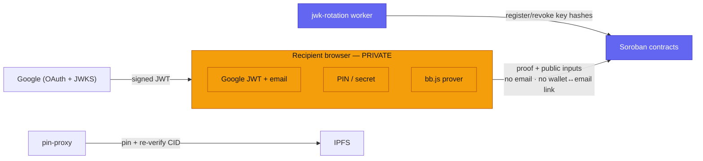

This page states Zarf's security posture plainly, including its limitations. It is
written for auditors and integrators.

> **Status:** Zarf runs on Stellar **testnet** only. Mainnet is deliberately gated
> on a third-party audit — the contracts custody funds and verify the proofs that
> release them, so the mainnet GO is held until that review lands. The code has
> **not** been audited. See [project status](/resources/project-status/).

## Assets and actors

**Assets**

- Tokens held in each Vesting contract until claimed.
- Recipient identity — the email, and the wallet↔email link.
- The trust anchors: the on-chain verification key and the set of trusted Google
  signing-key hashes.

**Actors**

- **Creator** — funds a distribution; owns the Factory deployment salt.
- **Recipient** — proves eligibility and claims.
- **Zarf services** — indexer, pin-proxy, and the JWK rotation worker. None can
  move funds.
- **JWK Registry owner** — the operator who keeps the on-chain key set in sync.

## Trust boundaries

- **Browser proving.** The email, JWT, PIN, and wallet↔email link stay in the
  recipient's browser. Only the proof and its public inputs go on-chain. See
  [the ZK stack](/developers/zk-stack/) and the
  [privacy model](/learn/privacy-model/).
- **Google.** The whole email proof anchors on Google's RSA signature over the
  JWT. You trust that Google's signing keys are honest and that the on-chain key
  set stays current (see [JWK rotation](/developers/jwk-rotation/) and issue 002
  below).
- **IPFS.** Distribution metadata is pinned via pin-proxy, which re-hashes the
  gateway bytes with a zero-dependency CIDv0 dag-pb reconstruction
  (`web/packages/core/lib/utils/cidVerify.ts`) so a byte-swapping gateway is caught.
  You still trust that at least one pin keeps the content available. See
  [IPFS & metadata](/developers/ipfs-and-metadata/).
- **Cloudflare Workers.** The JWK rotation worker is stateless — it reads the
  current registry state from the Soroban contract, so there is no worker-side
  state to trust. The indexer is read-only and edge-cacheable; the pin-proxy only
  pins and verifies. None of the workers can move funds or forge proofs.

## What on-chain verification guarantees

The core claim / verify / factory / custody logic was reviewed against `main`
(`0060070`) with no unprivileged fund-theft or double-claim exploit found. The
guarantees that hold:

- **The proof is verified on-chain.** Public inputs and the `vk_hash` are bound to
  the proof via the Fiat–Shamir transcript; the verifier enforces the public-input
  count against the VK, the Vesting contract enforces exact length and per-field
  canonical range, and the final BN254 pairing gate is present.
- **The claim is tightly bound.** It binds the Merkle root, the recipient (via
  `require_auth`), the audience, `unlock_time`, and `jwt_exp`; the amount is bounded
  with canonical + checked `i128` math. A stolen proof cannot be redirected to
  another wallet.
- **Double-claim is prevented.** The claimed/nullifier flag lives in **persistent**
  storage (it survives TTL archival — a restore yields `true`) and is set **before**
  the external token transfer, so the claim path is reentrancy-safe.
- **The trust anchors are stable.** The Vesting contract's dependencies (verifier,
  JWK registry, token) are immutable post-deploy, and the Factory uses an
  owner-bound deploy salt, so an attacker cannot squat a predictable address.

**What Zarf's own services therefore cannot do:** move funds (payout requires the
claimant's `require_auth` and the in-proof recipient binding), forge a valid proof
(verification is on-chain against an immutable VK), or learn the wallet↔email link
(it is never revealed at any step).

## Origin isolation as a control

Origin isolation is itself a security control: the ZK prover and the Google
JWT/PIN handling live only on `claim.zarf.to`, so a compromise elsewhere cannot
reach them, and vice-versa. Both distribution families resist claim redirection —
the wallet airdrop bakes the recipient into the leaf plus `claimant.require_auth`,
and (in current source) the ZK claim binds the recipient into the Google-signed
id_token via PR #9's OIDC-`nonce` circuit assertion, so a stolen JWT + PIN can only
prove for the wallet the victim requested. Full rationale in the
[architecture overview](/developers/architecture/).

<!-- TODO(verify): the original rationale here (from plans/origin-split-impl.md /
memory) was (1) claim.zarf.to keeps 'unsafe-eval' for acvm_js, and (2) a ZK claim
is redirectable. Current source contradicts both: at HEAD 3be14ec (PR #9) NO web
origin ships 'unsafe-eval' (script-src is 'self' 'wasm-unsafe-eval' 'blob:'
https://static.cloudflareinsights.com), and the OIDC-nonce binding closes the
redirection path. PR #9's web apps + on-chain VK are deploy-gated, so the deployed
testnet stack may still lag source. Reconcile the eval-posture framing and confirm
the eval-free CSP + nonce-binding VK are what is actually deployed. -->

## Known issues

These are tracked internally in `issues/` (not public GitHub issues). Stated
honestly with current status.

| ID | Severity | Summary | Status |
|---|---|---|---|
| 001 | ~~HIGH~~ → false alarm | jwk-registry hardening appeared missing | Resolved by pull |
| 002 | MEDIUM | Key validity has no on-chain expiry (fail-open on stale keys) | Open |
| 003 | LOW | No owner withdraw/sweep — unclaimed funds stay locked | Open |
| 004 | INFO | Verifier trusts deployer-supplied `vk_hash` without recomputing | Open |

**001 — JWK hardening (resolved).** The audit ran against a checkout one commit
behind `origin/main`; the operator/timelock/two-step-handover hardening for the
JWK registry is present in PR #9 (`3be14ec`), not missing. This was a stale-checkout
artifact, not a code gap. Findings 002–004 still need re-verification against the
hardened source.

**002 — No on-chain key expiry (MEDIUM, defense-in-depth).** `is_valid_key_hash`
returns `true` for any registered, non-revoked hash indefinitely; there is no
on-chain validity TTL. A key is only removed if the off-chain rotation job runs and
calls `revoke_key` (it does, for keys dropped from Google's JWKS, with
`REVOKE_REMOVED_KEYS` defaulting to `true`). If the rotation job stalls or that flag
is disabled, a rotated-out Google key stays valid forever — and since keys are
often rotated because of possible compromise, an attacker holding a retired private
key could mint a JWT with a future `exp` and pass the claim's `jwt_exp` check. The
contract is **fail-open** on stale keys; safety depends on an external cron.
*Mitigation:* treat the rotation worker as security-critical — monitor its
liveness, never disable `REVOKE_REMOVED_KEYS` in production. A future on-chain
validity window would make this fail closed.

**003 — No owner withdraw/sweep (LOW, fund-safety footgun).** The Vesting contract
has **no** `withdraw` / `sweep` / `refund` / `recover` / `emergency` entrypoint.
Tokens can leave a vesting contract **only** through a valid `claim`. Consequently:

- Recipients who never claim — and any over-funded amount — leave tokens
  **permanently locked**, with no recovery path for the creator.
- There is no on-chain check that the deposit covers the total claimable. An
  under-funded distribution becomes first-come-first-served until the balance is
  exhausted; later valid claimants hit a transfer/insufficient-balance error.

This is rug-resistant, which is a plus, but it means **you should only distribute
what you can afford to lock**. See
[costs & funding](/creators/costs-and-funding/) and
[operational notes](/creators/operational-notes/).

**004 — `vk_hash` not recomputed at deploy (INFO).** The verifier stores the
caller-supplied `vk_hash` verbatim and never checks `vk_hash == keccak(vk_bytes)`.
This is deploy-time and deployer-trusted only: because the `vk_hash` is bound into
the Fiat–Shamir transcript, a mismatch simply breaks verification rather than
weakening it, and it is not exploitable by third parties. The risk is a misconfigured
deployment silently binding proofs to the wrong domain. Recomputing the hash at
construction would remove the footgun.

## Deployed-WASM lag

Contract fixes (contract TTL extension, factory footprint) were merged
**2026-06-12**, but the currently deployed testnet contracts may still run older
WASM. Treat the deployed testnet contracts as potentially behind source until a
redeploy is confirmed — see [deployed contracts](/resources/deployed-contracts/).

## Audit status and disclosure

Zarf has **not** been audited; mainnet is gated on that audit by design. This is a
showcase project by Trion Labs. Report security concerns to
**contact@trionlabs.dev**.
