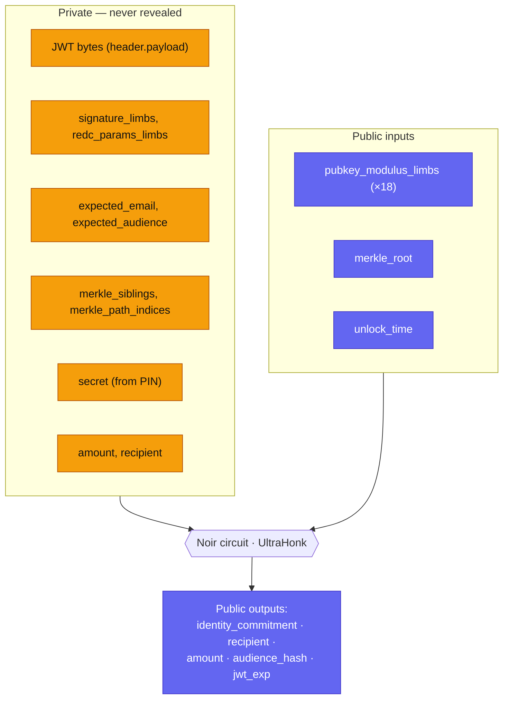
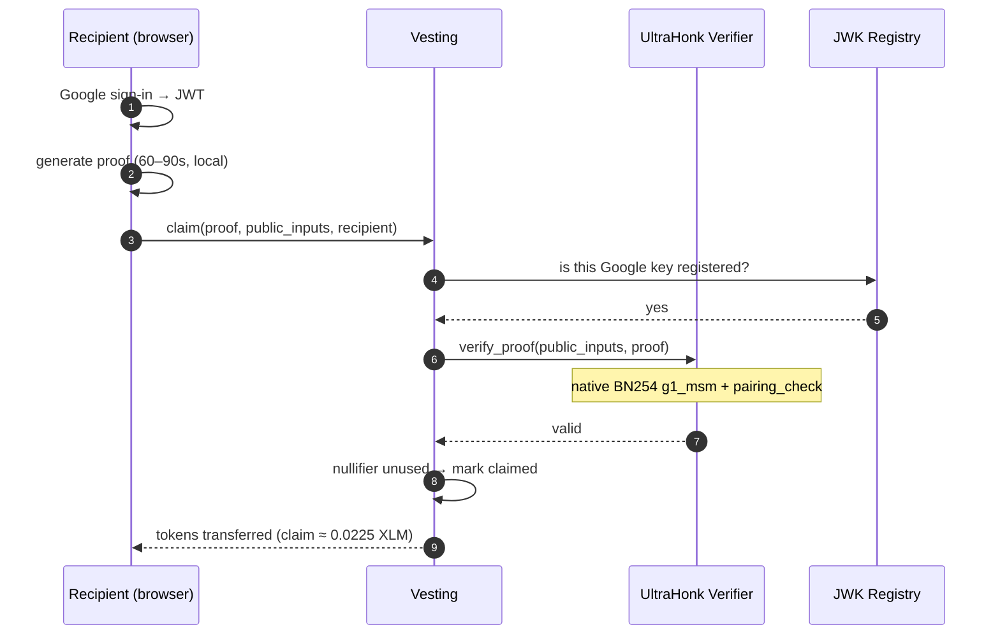
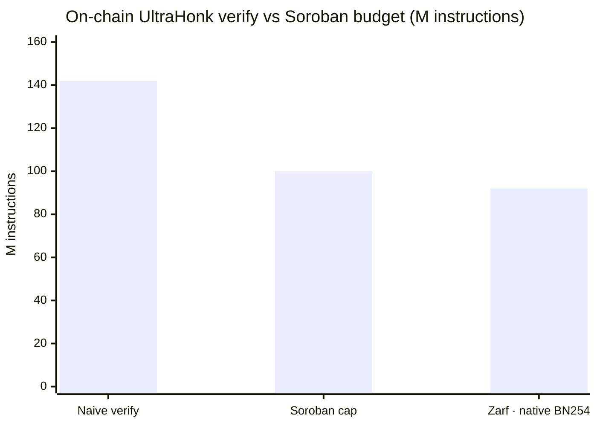

Zarf's email flow rests on one idea: prove *"Google signed a login token for an
email E, and E is in this distribution"* — **without revealing E**. The proof is
generated in the recipient's browser and verified on-chain by a Soroban contract.
Internally this primitive is called a **zkWT** (a JWT proven in zero-knowledge).

The circuit is written in [Noir](https://noir-lang.org/) and proved with
UltraHonk via Aztec's [bb.js](https://github.com/AztecProtocol/aztec-packages).
This page is a reference for what the circuit asserts and how the proof travels
from the browser to the chain.

## What the circuit proves

The circuit lives in `circuits/src/main.nr` and depends on the
[`noir-jwt`](https://github.com/zkemail/noir-jwt) library (`jwt` tag `v0.5.1`) for
in-circuit JWT verification. On one input it asserts all of the following:

1. **The JWT signature is valid.** `JWT::init(...)` then `jwt.verify()` checks
   Google's RSA signature over the signed `header.payload` bytes, using the
   RSA public-key modulus limbs supplied as a *public* input.
2. **The issuer is Google.** `assert_google_issuer` requires the `iss` claim to be
   `https://accounts.google.com` or the bare `accounts.google.com`.
3. **The audience matches this app.** `assert_expected_audience` requires the `aud`
   claim to equal the expected Google OAuth client ID.
4. **The email is verified.** `email_verified` must be `true`.
5. **The email matches the expected recipient.** `jwt.assert_claim_string("email", expected_email)`.
6. **The recipient is bound into the token.** `assert_nonce_binds_recipient`
   requires the id_token's OIDC `nonce` claim to equal the lowercase 64-hex
   encoding of the `recipient` field. Because Google signs the `nonce`, a stolen
   id_token can only ever prove for the wallet the victim requested — this is what
   closes the token-theft claim-redirection path (added in PR #9, the current
   `main`).
7. **Identity is committed unlinkably.** The circuit computes
   `email_hash = pedersen(email bytes)`, `secret_hash = pedersen(secret)` — the
   `secret` is derived from the per-recipient PIN — and
   `identity_commitment = pedersen(email_hash, secret_hash)`. The same email with
   a different secret yields a completely different commitment (unlinkability,
   per ADR-012). The raw `email_hash` is never exposed.
8. **The recipient is in the Merkle root.** The leaf is
   `pedersen(identity_commitment, amount, unlock_time)`, and the circuit walks a
   Merkle path of depth `TREE_DEPTH = 20` (supporting up to 2²⁰ ≈ 1M recipients),
   asserting the computed root equals the public `merkle_root`.

### Public vs private inputs

`main.nr` declares three groups of public inputs — `pubkey_modulus_limbs` (18
limbs), `merkle_root`, and `unlock_time` — and returns five public outputs:
`(identity_commitment, recipient, amount, audience_hash, jwt_exp)`. That is **25
public values** in total. The Vesting contract consumes exactly this layout
(`PUBLIC_INPUT_FIELDS = 25` in `contracts/soroban/zarf/vesting/src/lib.rs`),
ordered `[pubkey×18, merkle_root, unlock_time, epoch_commitment, recipient,
amount, audience_hash, jwt_exp]`, where the on-chain `epoch_commitment` field is
the circuit's `identity_commitment` output. The public-inputs blob is 800 bytes
(25 × 32).

<!-- Verified: the current circuit proof fixture is 9088 bytes (~8.9 KB); the
dev-call deck's ≈8.7 KB (8736-byte) figure predates PR #9's OIDC-nonce VK bump,
which regenerated the VK/proof. The 25-field public-inputs count is unchanged. -->

<!-- Verified: circuits/src/main.nr sets MAX_DATA_LENGTH = 1536 (PR #9 / commit
3be14ec, the current HEAD) — sized for a real Google id_token that also carries
the 64-char `nonce` claim; the earlier 1024 was tight for production tokens. -->

## The three assertions, and replay resistance

Restated for integrators, the proof attests three things at once: the JWT is
validly signed by a **registered** Google key; the email is in the recipient
**Merkle tree**; and the claim is **bound to the wallet claiming right now**.

That last binding is what stops a stolen proof from being redirected. The
`recipient` public value is `BN254_Fr(keccak256(recipient Address ScVal XDR))`,
and the Vesting contract enforces `recipient.require_auth()` and that the caller
matches the bound recipient. A proof generated for one wallet cannot be replayed
against another. Beyond proof replay, the recipient is also bound *inside* the
Google-signed token via the OIDC `nonce` (assertion 6 above), so even a stolen
id_token + PIN cannot mint a fresh proof for an attacker's wallet. Because the
recipient can be derived off-chain via the Factory's `recipient_id(recipient)`, a
Stellar-bound proof can be generated before the vesting instance even exists.

Each recipient can claim once: the Vesting contract records a per-recipient
nullifier and rejects a second claim (`is_claimed`). The circuit's
`identity_commitment` is the basis for that nullifier.

<!-- Verified: the on-chain nullifier is the public-input field at
EPOCH_COMMITMENT_INDEX (index 20 = the circuit's first output,
identity_commitment); the Vesting contract stores it directly as the
DataKey::Claimed key — it is not re-derived on-chain or bound to unlock_time
(contracts/soroban/zarf/vesting/src/lib.rs). -->

## Proving in the browser

The recipient's browser generates the proof; nothing sensitive leaves the device.
Proving runs in a Web Worker (`web/packages/core/lib/zk/proof.worker.ts`) and pulls
in, via runtime dynamic imports:

- `@aztec/bb.js` (v2.1.9) — the `UltraHonkBackend` prover.
- `@noir-lang/noir_js`, `@noir-lang/noirc_abi`, `@noir-lang/acvm_js` (all
  `1.0.0-beta.18`) — Noir execution and ABI handling.
- `noir-jwt` (`0.4.5`) — the JWT input builder.

The worker fetches the compiled circuit artifact (`circuits/target/zarf.json`) at
runtime and caches it. Generating a proof takes roughly **60–90 seconds**
single-threaded today; it is parallelizable and could be relayed.

**Browser proving and CSP.** The prover (`@noir-lang/acvm_js` plus the bb.js WASM)
runs only on `claim.zarf.to`. In current source (PR #9, HEAD `3be14ec`) that
origin's `script-src` is **eval-free** — `'self' 'wasm-unsafe-eval' 'blob:'
https://static.cloudflareinsights.com`, with **no `'unsafe-eval'`**
(`web/apps/claim/svelte.config.js`); the WASM loads under `'wasm-unsafe-eval'`.
See the [architecture overview](/developers/architecture/) for the origin-split
rationale.

<!-- TODO(verify): earlier design notes (plans/origin-split-impl.md and the
project memory) held that @noir-lang/acvm_js REQUIRES 'unsafe-eval' and that
claim.zarf.to must keep it. PR #9 removed 'unsafe-eval' from BOTH create and claim
(commit: "strict nonces, no unsafe-inline/eval"), asserting acvm_js compiles under
'wasm-unsafe-eval'. That has not been re-confirmed with a live in-browser proof
run here, and PR #9 is deploy-gated (create/claim excluded from auto-deploy
pending a live testnet Google-OAuth round-trip), so the DEPLOYED claim origin may
still run the older 'unsafe-eval' CSP. Confirm the eval-free CSP proves
end-to-end before stating it as settled fact. -->

## Verifying it on Soroban

On-chain verification is where these designs usually die. UltraHonk's verifier is
roughly **142M instructions**, and Soroban's budget is **100M per transaction** —
naively impossible.

Stellar's **native BN254 host functions (CAP-0080, Protocol 26+)** make it fit. The
verifier (`contracts/soroban/verifier/ultrahonk-soroban-verifier`) calls
`env.crypto().bn254()` for the two heavy operations:

- **`g1_msm`** — multi-scalar multiplication on G1 (`ec.rs`).
- **`pairing_check`** — the final BN254 pairing gate (`ec.rs`, used by the
  Shplemini/Shplonk check).

Fiat–Shamir transcript hashing uses the Soroban host `keccak256`
(`env.crypto().keccak256(...)`), matching bb.js's UltraKeccakHonk flavor. The
verification key is parsed and stored once in the verifier's `__constructor` and is
immutable afterward; `verify_proof` always uses that stored VK. The `vk_hash` is
bound into the Fiat–Shamir transcript, so a proof is only valid against the exact
VK it was generated for.

### The instruction budget

Native BN254 drops on-chain verification from ~142M instructions to under the 100M
cap, and makes a claim cost about **0.0225 XLM** on testnet.

## No trusted setup

UltraHonk uses a **universal SRS** — one setup serves every circuit — so Zarf needs
no per-circuit trusted-setup ceremony.

## Where to go next

- [Contracts reference](/developers/contracts/) — the exact `verify_proof` and `claim` signatures and the on-chain public-input layout.
- [JWK rotation](/developers/jwk-rotation/) — how Google's signing keys stay trusted.
- [Security model](/developers/security-model/) — what on-chain verification does and does not guarantee.
