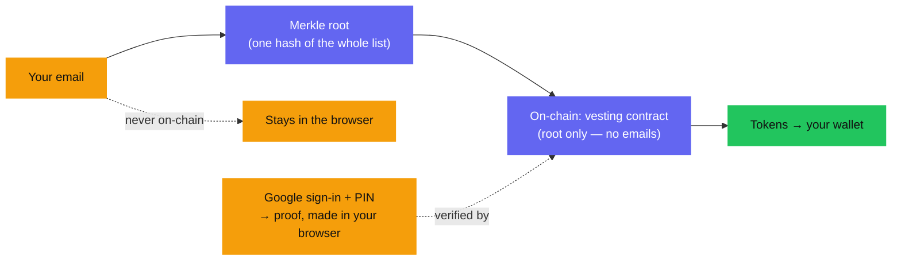

Zarf's privacy is not encryption — it's **selective disclosure.** The chain
learns one fact: *"a valid, eligible recipient is claiming."* It never learns
*which* recipient. This page lays out precisely what is public, what is private,
and what Zarf's own services can and cannot see.

## Your email never touches the chain

When a distribution is created, every email is hashed into a single **Merkle
root** and only that root is published. When you claim, you sign in with Google
and your browser produces a zero-knowledge proof; the email stays inside the
browser, and only the proof and its public inputs are sent on-chain.

## On-chain vs. off-chain

This is the whole privacy story in one table. "On-chain" means anyone in the
world can read it on a block explorer; "off-chain" means it never leaves your
browser (or the creator's).

| Step | Stays private (off-chain) | Goes public (on-chain) |
|---|---|---|
| **Create — build the list** | each email, each per-recipient PIN/secret | `merkle_root`, `audience_hash` |
| **Create — deploy** | the recipient list itself | vesting address, `recipient_count`, total amount, metadata CID |
| **Claim — sign in** | your email (inside the Google token, in the browser) | — |
| **Claim — prove** | email, PIN secret, Google token, Merkle path, the wallet↔email link | the proof and its public inputs (Merkle root, unlock time, recipient binding, epoch commitment) |
| **Claim — payout** | *who you are* | amount, recipient wallet address, the `claimed` event |

Two things are worth calling out:

- The **wallet↔email link is never revealed at any step.** The chain only ever
  sees commitments (the Merkle root, and a one-time epoch commitment) plus a
  verified proof.
- The **payout is not invisible.** Your wallet address, the amount, and a
  `claimed` event *are* public — that's how a transfer on any blockchain works.
  What no one can do is *prove* that this wallet belongs to a specific email or
  person. The distribution's recipient list stays confidential.

## What the claim transaction reveals — and to whom

When you claim, the transaction carries a zero-knowledge proof and its public
inputs. Verifiers (the contract, and anyone reading the ledger) can confirm all
of the following **without learning your email**:

- Google signed a login token for an email that is in this distribution's list.
- That token was issued for the Zarf app and marks the email as verified.
- The claim is **bound to the wallet claiming right now** — so a proof captured
  from someone else can't be replayed to a different wallet.
- This specific allocation hasn't been claimed before.

The email address, the PIN, the raw Google token, and your position in the
recipient list all stay private. What's proven is membership and validity, not
identity.

## What Zarf's own services can and cannot see

Zarf is designed so its own infrastructure is not a privacy hole:

- **The create app never uploads your raw email list to a server.** The Merkle
  tree and the per-recipient PINs are computed **in the creator's browser**. The
  creator downloads a `secrets.csv` (each recipient's email + PIN) locally and
  sends the claim links themselves. Only hashes and commitments — never raw
  emails — are pinned to IPFS.
- **The claim app never sees your email leave the browser.** Google sign-in and
  proof generation both happen client-side; only the finished proof is
  submitted. See [why the claim app is isolated](/learn/trust-assumptions/).
- **Google** sees that you signed in to the Zarf app, as it would for any "Sign
  in with Google" — but it isn't told your wallet or the distribution details.
- **The pinning service** (pin-proxy) stores the distribution's JSON — the Merkle
  root, the leaf hashes, and the schedule — on IPFS. It does not hold raw emails,
  and it keeps its storage credentials server-side.
- **The indexer** only reports public on-chain data, such as which distributions
  exist and which allocations have been claimed.

## Where this comes from

The privacy properties above are enforced by the zero-knowledge circuit and the
on-chain contracts, not by a promise. If you want the cryptographic detail — the
exact statement the circuit proves and how it's verified on Soroban — see the
[ZK stack](/developers/zk-stack/). For what you have to trust for this to hold,
read [trust assumptions](/learn/trust-assumptions/).
