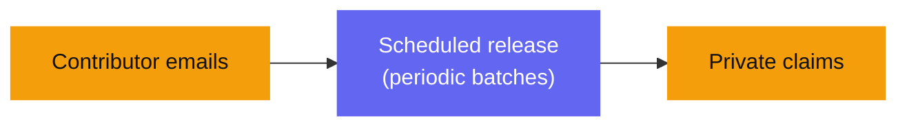
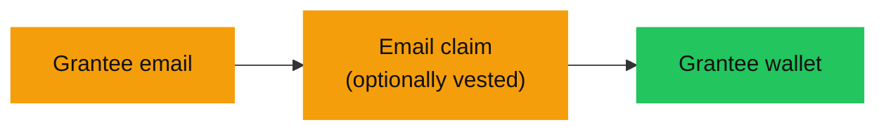
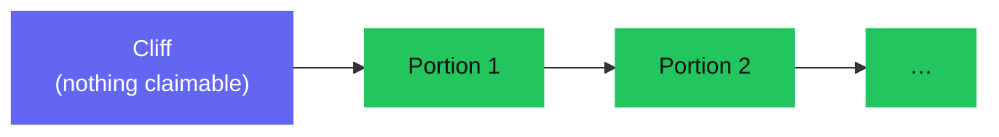

Zarf fits anywhere you need to move tokens to a group of people without turning
that group into public record. Here are four common scenarios. Find yours, then
follow the linked playbook.

## Community airdrop

**Who:** a project running a token generation event or a community reward.

**The problem today:** the moment you airdrop on-chain, your entire allocation
map is public — who got how much, and every recipient's wallet — and it stays
that way forever. Recipients also need a wallet *before* they can receive
anything, which loses a lot of non-crypto users.

**How Zarf handles it:** you upload a CSV of emails, and only a Merkle root of
the audience goes on-chain. Recipients claim with a Google login — no wallet
needed to receive — and the allocation map never becomes public.

→ [Airdrop playbook](/creators/playbooks/airdrop/)

## Payroll

**Who:** a DAO or company paying contributors in tokens.

**The problem today:** putting payroll on-chain publishes everyone's salary,
permanently, for anyone to read and compare.

**How Zarf handles it:** pay to emails instead of wallets, with a vesting
schedule for periodic release. Amounts and the recipient list stay confidential —
the chain sees commitments and claims, not a public salary table. Note that
running repeated pay cycles is a manual, per-cycle operation today; the
[payroll playbook](/creators/playbooks/payroll/) is honest about what that
involves.

→ [Payroll playbook](/creators/playbooks/payroll/)

## Grants and bounties

**Who:** a foundation or program paying grantees, or a project paying out
bounties.

**The problem today:** paying a grant on-chain doxxes the grantee's wallet and
the amount, which recipients often don't want public.

**How Zarf handles it:** grantees receive an email-gated claim — no wallet
address collected up front, and no public link between the payout and the person.
You can add a cliff or a schedule if the grant vests.

→ [Grants playbook](/creators/playbooks/grants/)

## Vested token distribution

**Who:** teams, advisors, or early backers receiving tokens that unlock over
time.

**The problem today:** vesting schedules on-chain expose exactly who is unlocking
how much and when — a map of every stakeholder's position.

**How Zarf handles it:** the same email or wallet distribution, with a real
on-chain schedule — a cliff, then release in scheduled portions. Recipients claim
each portion as it unlocks, and the schedule doesn't advertise identities.

→ [Design a vesting schedule](/creators/vesting-design/)

## Not sure where to start?

- Compare the two distribution types in [email vs. wallet](/creators/email-vs-wallet/).
- Understand the privacy guarantees in the [privacy model](/learn/privacy-model/).
- Jump straight in with the [creator quickstart](/creators/quickstart/).
