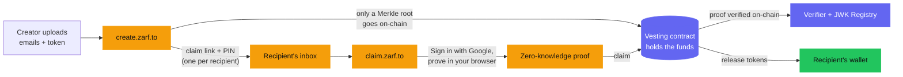

Zarf lets you distribute tokens to an **email address** instead of a wallet
address. Recipients claim with a familiar "Sign in with Google" — and their
browser quietly proves they own that email using a zero-knowledge proof, so the
email never touches the chain and no one can link a wallet to a person. It runs
on Stellar's Soroban smart-contract platform and is built by
[Trion Labs](https://trionlabs.dev).

The idea in one sentence: **send tokens to an email, claim with a Google login,
and nothing on-chain says who received what.**

## Why it exists

When you run an airdrop or payroll directly on-chain, you publish **everyone's
wallet and amount — permanently.** Salaries, grants, and allocations become
public forever, and every recipient needs to already own a wallet before they
can receive anything. That transparency is great for a public exchange, but it's
a liability for a distribution.

Zarf keeps the useful parts of on-chain distribution (funds held in a contract,
programmable release schedules, verifiable claims) while removing the privacy
cost. The chain only ever sees a commitment to the recipient list and a proof
that a claim is valid — never who the recipients are.

## Two ways to distribute

Zarf has two product families. Pick the one that matches what you already have.

**Email (ZK) distributions — [create.zarf.to](https://create.zarf.to).** You
upload a CSV of email addresses; only a *Merkle root* (a single hash that stands
in for the whole list) goes on-chain. Each recipient gets an email with a claim
link and a PIN, signs in with Google at
[claim.zarf.to](https://claim.zarf.to), and their browser generates a
zero-knowledge proof (built with [Noir](https://noir-lang.org/) and verified
with an UltraHonk verifier) that they own the email. The proof is checked
**on-chain**, using Soroban's native BN254 cryptography, without the email ever
being revealed.

**Wallet airdrops — [airdrop.zarf.to](https://airdrop.zarf.to).** A classic
address-whitelist distribution: you provide wallet addresses instead of emails,
recipients claim by connecting their wallet, and there's no ZK proof involved.
It uses the same on-chain scheduling model (cliffs and periodic release) as the
email flow.

Not sure which to use? See [email vs. wallet](/creators/email-vs-wallet/).

## How an email distribution flows

Amber is off-chain and private (it never
leaves the browser or the inbox); indigo is
public and on-chain; green is the funds
landing in a wallet.

## What makes it different

- **Real privacy, not just pseudonymity.** The recipient's email never goes
  on-chain, and the link between a wallet and the person behind it is
  *unprovable* — even to the sender. See the [privacy model](/learn/privacy-model/).
- **Email-first claiming.** Recipients don't need a wallet to *receive* — only to
  *claim*. A Google login lowers the barrier for people who have never touched
  crypto.
- **On-chain and programmable.** Funds sit in a Soroban contract with a real
  schedule: a cliff followed by release in scheduled portions. It's
  infrastructure for airdrops, grants, and payroll — not just one-off transfers.
- **Verified on-chain, cheaply.** The zero-knowledge proof is checked by a
  contract using Stellar's native BN254 host functions, at roughly **0.0225 XLM
  per claim** on testnet.

## Status: testnet only

Zarf runs on Stellar **testnet** today. Everything on this site works against
testnet, where the tokens have no real value.

Mainnet launch is **deliberately gated on a third-party security audit** — not a
delay. These contracts custody funds and verify the proofs that release them, so
we would rather ship it right than ship it fast. This is a showcase project by
Trion Labs; see [project status](/resources/project-status/) and
[trust assumptions](/learn/trust-assumptions/) for the honest picture.

## Where to go next

- **I received a claim email** → [Claim your tokens](/recipients/claim-your-tokens/)
- **I want to distribute tokens** → [Creator quickstart](/creators/quickstart/)
- **I'm building on Zarf** → [Architecture overview](/developers/architecture/)
- **How does the privacy work?** → [Privacy model](/learn/privacy-model/)
